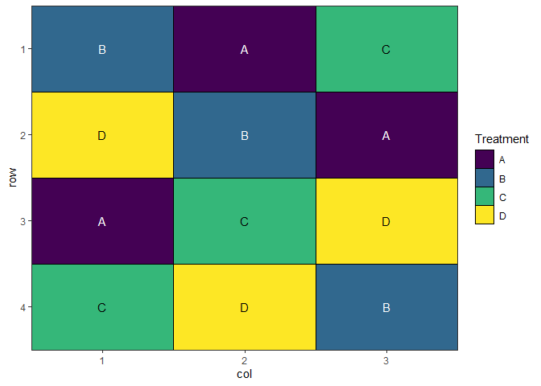
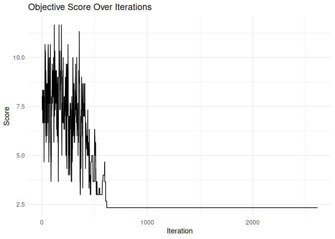
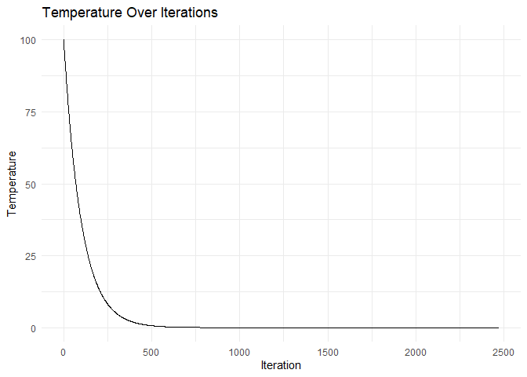
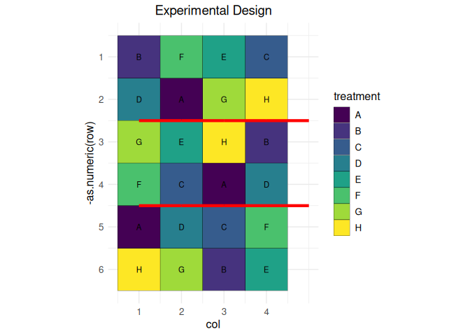

<!-- README.md is generated from README.Rmd. Please edit that file -->

# speed - Spatially Efficient Experimental Designs

<!-- badges: start -->

[](https://www.repostatus.org/#active)
[](https://github.com/biometryhub/speed/actions/workflows/R-CMD-check.yaml)
[](https://app.codecov.io/gh/biometryhub/speed)
[](https://choosealicense.com/licenses/mit/)

<!-- badges: end -->

## Overview

The `speed` package optimizes spatial experimental designs by
rearranging treatments to improve statistical efficiency while
maintaining statistical validity. It uses simulated annealing to:

- Minimize treatment adjacency (reducing neighbor effects)
- Maintain spatial balance across rows and columns
- Respect blocking constraints if specified
- Provide visualization tools for design evaluation

## Installation

You can install the development version of speed from
[GitHub](https://github.com/biometryhub/speed) with:

``` r
# install.packages("pak")
pak::pak("biometryhub/speed")
```

## Features

- Flexible optimization of experimental designs
- Support for blocked designs
- Customizable optimization parameters
- Built-in visualization functions
- Progress tracking during optimization
- Early stopping when convergence is reached

See the package documentation for more detailed examples and options.

## Basic Example

A simple example optimizing a 4×3 completely randomised design with 4
treatments:

``` r
library(speed)

# Create a simple design with 3 replicates of 4 treatments
df <- data.frame(
  row = rep(1:4, each = 3),
  col = rep(1:3, times = 4),
  treatment = rep(LETTERS[1:4], each = 3)
)

# Optimize the design with seed for reproducibility
result <- speed(df, "treatment", seed = 42)
#> Iteration: 1000 Score: 1 Best: 1 Since Improvement: 975 
#> Iteration: 2000 Score: 1 Best: 1 Since Improvement: 1975 
#> Early stopping at iteration 2025

# Plot the optimized design
autoplot(result)
```



``` r

# View optimization progress
plot_progress(result)
```



## Blocked design

You can also optimize designs within blocks:

``` r
# Create a design with blocks
df <- data.frame(
  row = rep(1:6, each = 4),
  col = rep(1:4, times = 6),
  treatment = rep(LETTERS[1:8], 3),
  block = rep(1:3, each = 8)
)

# Optimize while respecting blocks
result <- speed(df, 
                "treatment",
                swap_within = "block",
                iterations = 5000,
                seed = 42)
#> Iteration: 1000 Score: 2.571429 Best: 2.571429 Since Improvement: 394 
#> Iteration: 2000 Score: 2.571429 Best: 2.571429 Since Improvement: 1394 
#> Early stopping at iteration 2606

# Plot the design with block boundaries
autoplot(result)
```


