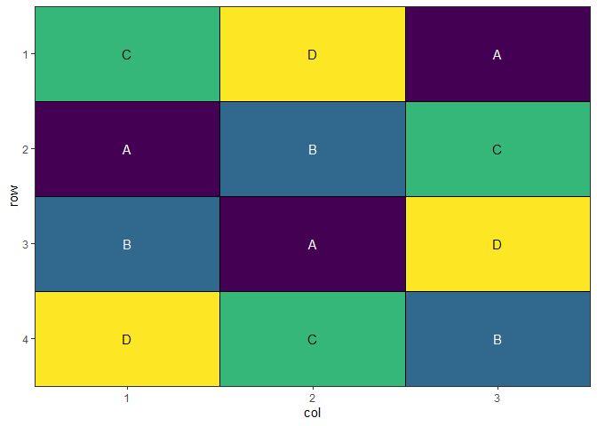

<!-- README.md is generated from README.Rmd. Please edit that file -->

# speed - Spatially Efficient Experimental Designs

<!-- badges: start -->

[](https://www.repostatus.org/#active)
[](https://github.com/biometryhub/speed/actions/workflows/R-CMD-check.yaml)
[](https://app.codecov.io/gh/biometryhub/speed)
[](https://choosealicense.com/licenses/mit/)

<!-- badges: end -->

## Table of Contents

<!-- vim-markdown-toc GFM -->

- [Overview](#overview)
- [Installation](#installation)
- [Features](#features)
- [Example](#example)
  - [Basic](#basic)
  - [Blocked design](#blocked-design)
  - [More Examples](#more-examples)
- [Citation](#citation)
- [License](#license)

<!-- vim-markdown-toc -->

## Overview

The `speed` package optimises spatial experimental designs by
rearranging treatments to improve statistical efficiency while
maintaining statistical validity. It uses simulated annealing to:

- Minimise treatment adjacency (reducing neighbour effects)
- Maintain spatial balance across rows and columns
- Respect blocking constraints if specified
- Provide visualisation tools for design evaluation

## Installation

You can install the development version of speed from
[GitHub](https://github.com/biometryhub/speed) with:

``` r
# install.packages("pak")
pak::pak("biometryhub/speed")
```

## Features

- Flexible optimisation of experimental designs
- Support for blocked designs
- Customisable optimisation parameters
- Built-in visualisation functions
- Progress tracking during optimisation
- Early stopping when convergence is reached

See the package documentation for more detailed examples and options.

## Example

### Basic

A simple example optimising a 4×3 completely randomised design with 4
treatments:

``` r
library(speed)

# Create a simple design with 3 replicates of 4 treatments
df <- data.frame(
  row = rep(1:4, each = 3),
  col = rep(1:3, times = 4),
  treatment = rep(LETTERS[1:4], each = 3)
)

# Optimise the design with seed for reproducibility
result <- speed(df, "treatment", seed = 42)
#> Iteration: 1000 Score: 1 Best: 1 Since Improvement: 475 
#> Iteration: 2000 Score: 1 Best: 1 Since Improvement: 1475 
#> Early stopping at iteration 2525

# Plot the optimised design
autoplot(result)
```



``` r

# View optimisation progress
plot_progress(result)
```


### Blocked design

You can also optimise designs within blocks:

``` r
# Create a design with blocks
df <- data.frame(
  row = rep(1:6, each = 4),
  col = rep(1:4, times = 6),
  treatment = rep(LETTERS[1:8], 3),
  block = rep(1:3, each = 8)
)

# Optimise while respecting blocks
result <- speed(df,
  "treatment",
  swap_within = "block",
  iterations = 5000,
  seed = 42
)
#> Iteration: 1000 Score: 2.571429 Best: 2.571429 Since Improvement: 543 
#> Iteration: 2000 Score: 2.571429 Best: 2.571429 Since Improvement: 1543 
#> Early stopping at iteration 2457

# Plot the design with block boundaries
autoplot(result)
```


### More Examples

For more detailed examples, see the [getting started
vignette](articles/speed.html) or the vignette about [more complex
examples](articles/complex_designs.html).

## Citation

If you use `speed` in your research, please cite:

    Warning in citation("speed"): could not determine year for 'speed' from package
    DESCRIPTION file
    To cite package 'speed' in publications use:

      Rogers S, Taylor J, Edson R, Pipattungsakul W (????). _speed:
      Generate Spatially Efficient Experimental Designs_. R package version
      0.0.1, <https://biometryhub.github.io/speed/>.

    A BibTeX entry for LaTeX users is

      @Manual{,
        title = {speed: Generate Spatially Efficient Experimental Designs},
        author = {Sam Rogers and Julian Taylor and Russell Edson and Wasin Pipattungsakul},
        note = {R package version 0.0.1},
        url = {https://biometryhub.github.io/speed/},
      }

## License

This project is licensed under the MIT License - see the
[LICENSE](LICENSE.md) file for details.
