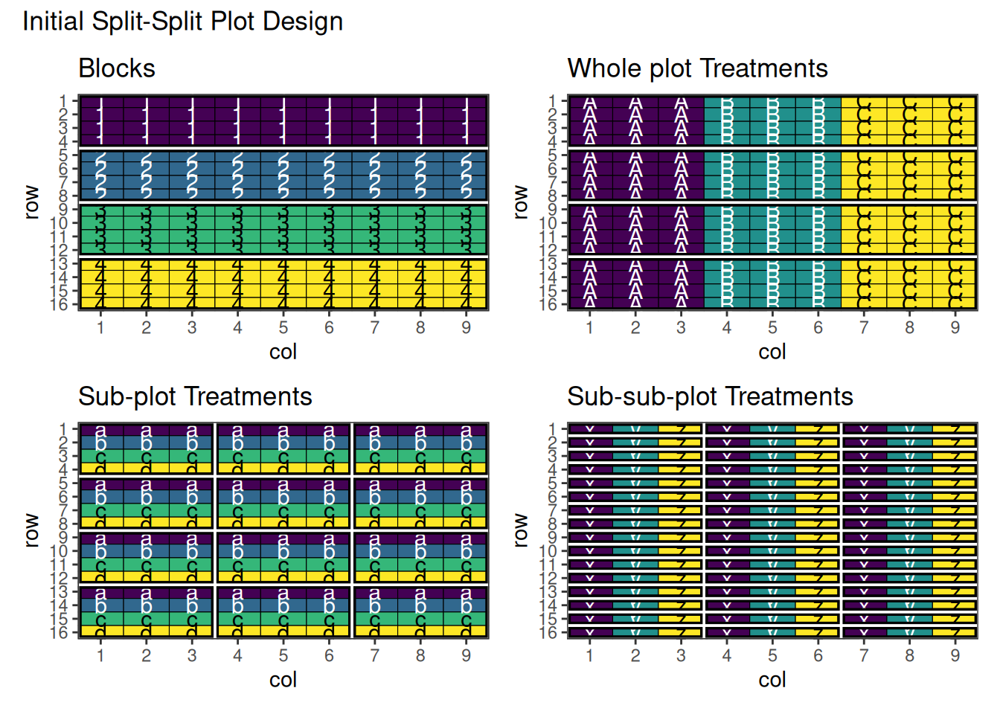
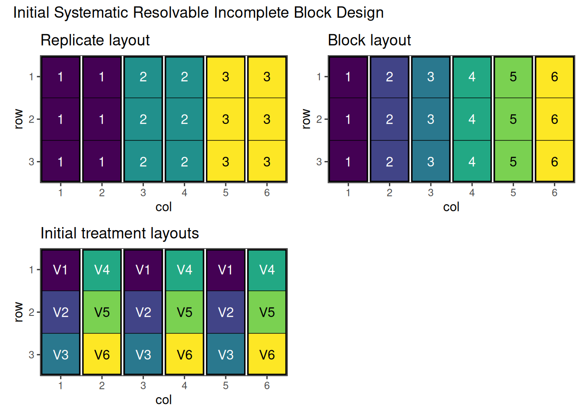
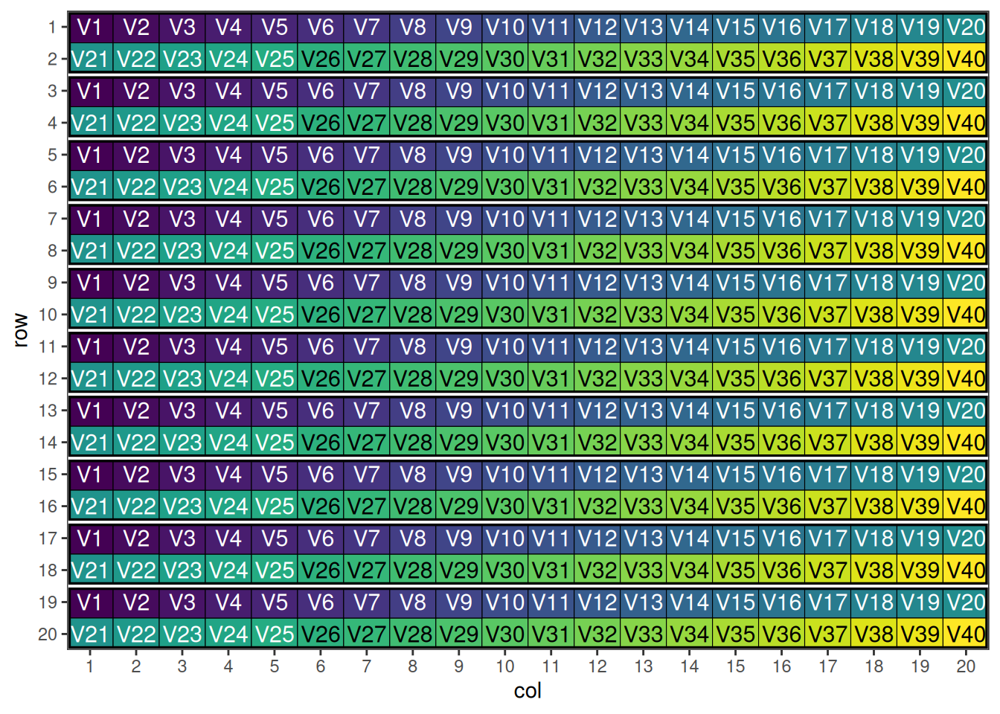
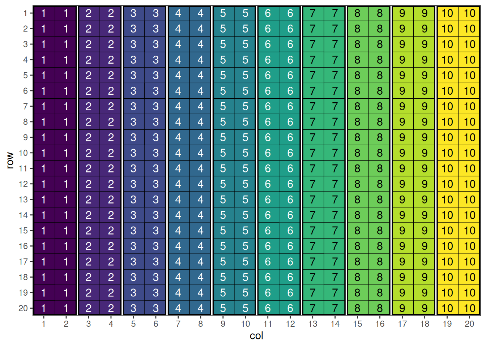
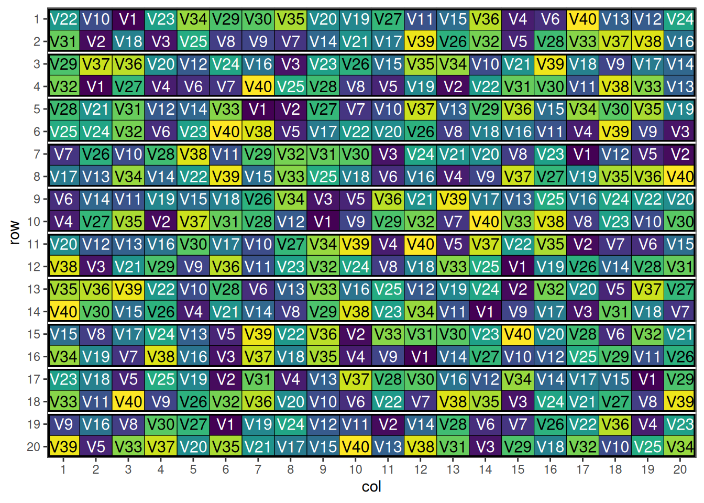

# Complex Agricultural Experimental Designs with speed

## Introduction

This vignette covers advanced and complex experimental designs that are
used in specialised agricultural research contexts. These designs are
particularly useful for plant breeding programs, large-scale variety
trials, and situations where standard complete block designs are
impractical due to resource constraints or the nature of the treatments.

Building on the foundational designs covered in the [Common Agricultural
Experimental Designs
vignette](https://biometryhub.github.io/speed/articles/speed.md), these
complex designs offer solutions for challenging experimental scenarios
while maintaining statistical rigour through spatial optimisation with
the `speed` package.

``` r
library(speed)
library(patchwork) # For combining plots
```

## Split-Split Plot Designs

### Overview

Split-split plot designs extend the hierarchical structure of
[split-plot
designs](https://biometryhub.github.io/speed/articles/speed.html#split-plot-design)
to accommodate three factors with different levels of experimental
difficulty or practical constraints. This creates a three-level
hierarchy of experimental units.

### Hierarchical Structure

#### Whole Plots (Main Plots)

- **Largest experimental units**
- **Factor A** applied to whole plots
- **Most difficult factor to randomise**
- **Example**: Tillage systems, irrigation methods

#### Sub-Plots (Split Plots)

- **Intermediate-sized units within whole plots**
- **Factor B** applied to sub-plots
- **Moderate randomisation difficulty**
- **Example**: Fertilizer treatments, planting dates

#### Sub-Sub-Plots (Split-Split Plots)

- **Smallest experimental units**
- **Factor C** applied to sub-sub-plots
- **Easiest factor to randomise**
- **Example**: Varieties, pesticide treatments

### Error Structure

Complex error structure with multiple error terms:

- **Whole plot error** for Factor A effects
- **Sub-plot error** for Factor B and A×B effects  
- **Sub-sub-plot error** for Factor C and higher-order interactions

### When to Use Split-Split Plot Designs

- **Three factors with different application constraints**
- **Hierarchical treatment structure** matches practical needs
- **Sequential application** of treatments over time
- **Resource or equipment limitations** for some factors

### Examples of Applications

#### Agricultural Examples

- **Tillage × Fertilizer × Variety** experiments
- **Irrigation × Planting Date × Cultivar** studies
- **Cover Crop × Nitrogen × Hybrid** trials

#### Industrial Examples

- **Temperature × Pressure × Catalyst** process studies
- **Machine × Operator × Material** quality experiments

### Example: Split-Split Plot Design for Agricultural Systems Research

Consider a complex agricultural trial examining Tillage System ×
Nitrogen Rate × Variety interactions with three hierarchical levels.

### Setting Up Split-Split Plot Designs with speed

``` r
split_split_df <- data.frame(
  row = rep(1:16, each = 9),
  col = rep(1:9, times = 16),
  block = rep(1:4, each = 36),
  # Fixed wholeplot assignment: 3 wholeplots per block, each 4×3
  wholeplot = rep(rep(1:3, each = 3), times = 16) + rep(0:3 * 3, each = 36),
  wholeplot_treatment = rep(rep(LETTERS[1:3], each = 3), times = 16),
  subplot = rep(1:48, each = 3),
  subplot_treatment = rep(rep(letters[1:4], each = 9), times = 4),
  subsubplot_treatment = rep(c("x", "y", "z"), 48)
)
```



Figure 1: Initial layout of the split-split-plot design showing
systematic treatment distribution.

This shows the initial split-split plot design with three-level
hierarchical structure.

#### Performing the Optimisation

``` r
result_ss <- speed(split_split_df,
                   swap = list(wp = "wholeplot_treatment",
                               sp = "subplot_treatment",
                               ssp = "subsubplot_treatment"),
                   swap_within = list(wp = "block",
                                      sp = "wholeplot",
                                      ssp = "subplot"),
                   iterations = list(wp = 2000, 
                                     sp = 5000, 
                                     ssp = 20000),
                   early_stop_iterations = list(wp = 1000, 
                                                sp = 3000, 
                                                ssp = 5000),
                   swap_all = TRUE, 
                   seed = 42)
```

    row and col are used as row and column, respectively.

    Optimising level: wp
    Level: wp Iteration: 1000 Score: 252 Best: 252 Since Improvement: 972
    Early stopping at iteration 1028 for level wp
    Optimising level: sp
    Level: sp Iteration: 1000 Score: 132 Best: 132 Since Improvement: 594
    Level: sp Iteration: 2000 Score: 132 Best: 132 Since Improvement: 1594
    Level: sp Iteration: 3000 Score: 132 Best: 132 Since Improvement: 2594
    Early stopping at iteration 3406 for level sp
    Optimising level: ssp
    Level: ssp Iteration: 1000 Score: 12 Best: 12 Since Improvement: 46
    Level: ssp Iteration: 2000 Score: 10 Best: 10 Since Improvement: 617
    Level: ssp Iteration: 3000 Score: 9 Best: 9 Since Improvement: 346
    Level: ssp Iteration: 4000 Score: 9 Best: 9 Since Improvement: 1346
    Level: ssp Iteration: 5000 Score: 9 Best: 9 Since Improvement: 2346
    Level: ssp Iteration: 6000 Score: 9 Best: 9 Since Improvement: 3346
    Level: ssp Iteration: 7000 Score: 9 Best: 9 Since Improvement: 4346
    Early stopping at iteration 7654 for level ssp 

#### Output of the Optimisation

``` r
result_ss
```

    Optimised Experimental Design
    ----------------------------
    Score: 393
    Iterations Run: 12091
    Stopped Early: TRUE TRUE TRUE
    Treatments:
      wp: A, B, C
      sp: a, b, c, d
      ssp: x, y, z
    Seed: 42 

#### Visualise the Output

``` r
res1 <- autoplot(result_ss, treatments = "wholeplot_treatment") + ggplot2::labs(title = "Whole plot Treatments")
res2 <- autoplot(result_ss, treatments = "subplot_treatment") + ggplot2::labs(title = "Sub-plot Treatments")
res3 <- autoplot(result_ss, treatments = "subsubplot_treatment") + ggplot2::labs(title = "Sub-sub-plot Treatments")
res1 + res2 + res3 +
  plot_layout(ncol = 2) +
  plot_annotation(title = "Optimised Split-Split Plot Design")
```


Figure 2: Final layout of the split-split-plot design showing optimised
treatment distribution.

Above is the final output of this design. Note that there are some
adjacent pairs of treatments in the sub-sub-plots. This is quite
difficult to avoid in these situations, however adjusting some of the
optimisation parameters may help with this. For further information, see
the vignette about [changing optimisation parameters for
speed](https://biometryhub.github.io/speed/articles/custom_objective_functions.md).

## Strip-Plot Designs

### Overview

Strip-plot designs are extensions of split-plot designs used when both
treatment factors are difficult to apply to small areas. Treatments are
arranged in strips that cross each other, creating a grid pattern where
intersections represent treatment combinations.

### Structure

- **Horizontal strips** for one factor (e.g., tillage methods)
- **Vertical strips** for another factor (e.g., planting dates)
- **Intersections** represent factor combinations
- **Whole plots** larger than traditional split-plot designs

### When to Use Strip-Plot Designs

- **Both factors require large application areas**
- **Machinery constraints** for both factors
- **Irrigation × cultivation** experiments
- **Planting date × row spacing** studies
- **When split-plot hierarchy doesn’t fit** the practical situation

### Advantages and Limitations

#### Advantages

- **Accommodates two “difficult-to-randomise” factors**
- **More flexible** than split-plot for certain applications
- **Maintains reasonable precision** for main effects
- **Practical for mechanised agriculture**

#### Limitations

- **Lower precision** for interaction effects
- **Complex analysis** with multiple error terms
- **Less efficient** than RCBD for most comparisons
- **Requires larger field areas**

### Example: Strip-Plot Design for Tillage × Planting Date

Consider an experiment testing 3 tillage methods and 4 planting dates
where both factors require large application areas.

### Setting Up Strip-Plot Designs with speed

``` r
df_strip <- data.frame(
  row = rep(1:12, each = 6),  # 12 rows total (4 rows per block x 6 blocks)
  col = rep(1:6, times = 12),  # 6 columns
  block = rep(rep(1:2, each = 3), times = 4) + rep(0:2*2, each = 24),  # 6 blocks, 12 plots each
  
  # Horizontal strips (3 levels, applied to rows within each block)
  vertical_treatment = rep(rep(LETTERS[1:3], times = 2), times = 12),  # A, B, C
  
  # Vertical strips (4 levels, applied to columns within each block)  
  horizontal_treatment = rep(rep(letters[1:4], each = 6), times = 3),  # a, b, c, d
  
  # Plot identifier within each block
  plot_in_block = rep(1:12, times = 6)
)
```


Figure 3: Initial layout of the strip plot design showing systematic
treatment distribution.

This shows the initial strip-plot layout with horizontal and vertical
strips before optimisation.

#### Performing the Optimisation

``` r
strip_result <- speed(df_strip,
                      swap = list(ht = "horizontal_treatment", vt = "vertical_treatment"),
                      swap_within = list(ht = "block", vt = "block"),
                      swap_all = TRUE)
```

    row and col are used as row and column, respectively.

    Optimising level: ht
    Level: ht Iteration: 1000 Score: 84 Best: 84 Since Improvement: 875
    Level: ht Iteration: 2000 Score: 84 Best: 84 Since Improvement: 1875
    Early stopping at iteration 2125 for level ht
    Optimising level: vt
    Level: vt Iteration: 1000 Score: 54 Best: 54 Since Improvement: 840
    Level: vt Iteration: 2000 Score: 54 Best: 54 Since Improvement: 1840
    Early stopping at iteration 2160 for level vt 

#### Output of the Optimisation

``` r
strip_result
```

    Optimised Experimental Design
    ----------------------------
    Score: 138
    Iterations Run: 4287
    Stopped Early: TRUE TRUE
    Treatments:
      ht: a, b, c, d
      vt: A, B, C
    Seed: -745752008 

#### Visualise the Output

``` r
autoplot(strip_result, treatments = "horizontal_treatment") + ggplot2::labs(title = "Tillage Treatments")
```


``` r
autoplot(strip_result, treatments = "vertical_treatment") + ggplot2::labs(title = "Planting Date Treatments")
```


An optimised strip-plot design with well-arranged treatment
combinations!

## Incomplete Block Designs

### Overview

When the number of treatments is large, complete blocks may be
impractical due to field size or resource constraints. Incomplete block
designs use smaller blocks where not all treatments appear in each
block, while still maintaining good statistical properties.

### Types of Incomplete Block Designs

#### Balanced Incomplete Block Design (BIBD)

The most restrictive but statistically optimal incomplete block design.

##### Characteristics:

- Each treatment appears in exactly $r$ blocks
- Each block contains exactly $k$ treatments
- Each pair of treatments appears together in exactly $\lambda$ blocks
- Perfect balance but limited parameter combinations

##### Parameters:

- $v$ = number of treatments
- $b$ = number of blocks  
- $r$ = number of blocks containing each treatment
- $k$ = number of treatments per block
- $\lambda$ = number of blocks containing each pair of treatments
- $bk = vr$ and $\lambda(v - 1) = r(k - 1)$

What may become apparent from the characteristics and parameters listed
above is that these designs are not trivial, and [there are specific and
limited combinations that will
work](https://en.wikipedia.org/wiki/Block_design#Pairwise_balanced_uniform_designs_(2-designs_or_BIBDs)).
In the case of speed, a custom objective function is required to ensure
that each pair of treatments appear the same number of times. For an
example and further discussion, see the [vignette on custom objective
functions](https://biometryhub.github.io/speed/articles/custom_objective_functions.md).

#### Resolvable Incomplete Block Design (RIBD)

More flexible incomplete block designs where blocks can be grouped into
complete replications.

##### Characteristics:

- Blocks can be organised into complete replications
- Each replication contains every treatment exactly once
- More flexible parameter combinations than BIBD
- Excellent for multi-location trials

#### Partially Balanced Incomplete Block Design (PBIBD)

Relaxes the balance requirements of BIBD while maintaining good
statistical properties.

### When to Use Incomplete Block Designs

- **Large number of treatments** (typically \>15-20)
- **Limited block size** due to field homogeneity constraints
- **Multi-location variety trials** where shipping costs limit
  replication
- **Resource limitations** preventing complete replication
- **Preliminary screening** of large treatment sets

### Example: Resolvable Incomplete Block Design for 6 Varieties

Consider a trial with 15 treatments where complete blocks would be too
large for field homogeneity. We’ll use an incomplete block design with
blocks of size 5.

### Setting Up a Resolvable Incomplete Block Design with speed

Firstly we need to create a data frame representing the incomplete block
design. Here we will use a systematic approach to generate the blocks
and treatment combinations.

``` r
# Create the data frame
ribd_df <- data.frame(
  row = rep(1:3, 6),                             # Row within each block
  col = rep(1:6, each = 3),                      # Column corresponds to block
  replicate = rep(1:3, each = 6),                # 3 replicates, 6 observations each
  block = rep(1:6, each = 3),                    # 6 blocks total, 3 treatments per block
  treatment = paste0("V", rep(1:6, times = 3))   # Treatment assignments
)

# View the design
head(ribd_df)
```

      row col replicate block treatment
    1   1   1         1     1        V1
    2   2   1         1     1        V2
    3   3   1         1     1        V3
    4   1   2         1     2        V4
    5   2   2         1     2        V5
    6   3   2         1     2        V6



Figure 4: Initial layout of the resolvable incomplete block design
showing systematic treatment distribution.

[Figure 4](#fig-ribdplot1) shows the systematic resolvable incomplete
block layout before optimisation. Note that replicates are made of two
blocks, in each of which half the treatments will appear, and replicates
are made up of pairs of blocks. The treatments can be swapped between
blocks, but need to remain within their replicate.

#### Performing the Optimisation

``` r
ribd_result <- speed(ribd_df, 
                     swap = "treatment", 
                     swap_within = "replicate", 
                     seed = 42)    
```

    row and col are used as row and column, respectively.

    Optimising level: single treatment within replicate
    Level: single treatment within replicate Iteration: 1000 Score: 1.8 Best: 1.8 Since Improvement: 527
    Level: single treatment within replicate Iteration: 2000 Score: 1.8 Best: 1.8 Since Improvement: 1527
    Early stopping at iteration 2473 for level single treatment within replicate 

#### Output of the Optimisation

``` r
ribd_result
```

    Optimised Experimental Design
    ----------------------------
    Score: 1.8
    Iterations Run: 2474
    Stopped Early: TRUE
    Treatments: V1, V2, V3, V4, V5, V6
    Seed: 42 

``` r
str(ribd_result)
```

    List of 8
     $ design_df     :Classes 'design' and 'data.frame':    18 obs. of  5 variables:
      ..$ row      : int [1:18] 1 1 1 1 1 1 2 2 2 2 ...
      ..$ col      : int [1:18] 1 2 3 4 5 6 1 2 3 4 ...
      ..$ replicate: int [1:18] 1 1 2 2 3 3 1 1 2 2 ...
      ..$ block    : int [1:18] 1 2 3 4 5 6 1 2 3 4 ...
      ..$ treatment: chr [1:18] "V3" "V2" "V1" "V4" ...
     $ score         : num 1.8
     $ scores        : num [1:2474] 9 7.4 5.8 6.8 5.4 4.6 4.2 4.2 4.2 4.2 ...
     $ temperatures  : num [1:2474] 100 99 98 97 96.1 ...
     $ iterations_run: num 2474
     $ stopped_early : logi TRUE
     $ treatments    : chr [1:6] "V1" "V2" "V3" "V4" ...
     $ seed          : num 42
     - attr(*, "class")= chr [1:2] "design" "list"

#### Visualise the Output

``` r
autoplot(ribd_result)
```


We see that each block by itself only contains half the treatments, but
when combined, the pairs have a full replicate. The algorithm has also
spatially optimised the treatments across rows and columns, giving a
nicely optimised resolvable incomplete block design.

## P-Rep (Partially Replicated) Designs

### Overview

P-rep designs are a modern approach to plant breeding trials where a
subset of entries (typically checks and selected test lines) are
replicated while the majority of test entries appear only once. This
provides a balance between statistical power and resource efficiency.

### Structure

- **Replicated entries**: Key checks and promising lines (typically
  20-25% of entries)
- **Unreplicated entries**: Majority of test lines (75-80% of entries)
- **Strategic replication**: Based on breeding program priorities
- **Spatial distribution**: Replicates spread throughout the trial

### Key Features

#### Flexible Replication

- **Variable replication levels** based on entry importance
- **Adaptive strategies** for different breeding stages
- **Resource-efficient** compared to full replication

#### Modern Analysis Methods

- **Mixed models** with spatial correlation
- **BLUP prediction** for unreplicated entries
- **Genomic information** integration possible
- **Spatial adjustment** for field variation

### When to Use P-Rep Designs

- **Large-scale breeding trials** (\>500 entries)
- **Early generation testing** with limited seed
- **Resource-constrained** breeding programs
- **High-throughput phenotyping** applications
- **When full replication is impractical**

### Example: P-Rep Design for Large Breeding Trial

Consider a breeding trial with 140 entries where 40 key entries (checks
and promising lines) are replicated twice while others appear once. This
is a single site design with two blocks.

### Setting Up P-Rep Designs with speed

``` r
prep_design <- data.frame(
  row = rep(1:14, each = 10), 
  col = rep(1:10, times = 14), 
  block = rep(rep(1:2, each = 5), 14),
  entry = c(paste0("V", rep(1:40, 2)), paste0("V", 41:100)) # 100 varieties, 40 duplicated
)

# Create an indicator for the duplicated entries
prep_design$duplicated <- duplicated(prep_design$entry) | duplicated(prep_design$entry, fromLast = TRUE)

head(prep_design)
```

      row col block entry duplicated
    1   1   1     1    V1       TRUE
    2   1   2     1    V2       TRUE
    3   1   3     1    V3       TRUE
    4   1   4     1    V4       TRUE
    5   1   5     1    V5       TRUE
    6   1   6     2    V6       TRUE


Figure 5: Initial layout of the p-rep design showing systematic
treatment distribution.


Figure 6: Initial layout of the p-rep design showing replicated
treatments.

This shows the initial p-rep design with duplicated entries distributed
systematically. Once we have set up the data frame, the
[`speed()`](https://biometryhub.github.io/speed/reference/speed.md)
optimisation call is quite straight-forward. Note that we have added
`block` into the `spatial_factors` argument, to attempt to balance the
replicated treatments between blocks as well. Typically with larger
designs, we may also want to increase the number of `iterations` and
`early_stop_iterations` to allow more swapping to take place, however in
this case it is not necessary due to the low replication.

#### Performing the Optimisation

``` r
prep_result <- speed(prep_design,
                     swap = "entry",
                     spatial_factors = ~ block + row + col, 
                     seed = 42)
```

    row and col are used as row and column, respectively.

    Optimising level: single entry within whole design
    Level: single entry within whole design Iteration: 1000 Score: 2.993939 Best: 2.993939 Since Improvement: 5
    Level: single entry within whole design Iteration: 2000 Score: 2.913131 Best: 2.913131 Since Improvement: 818
    Level: single entry within whole design Iteration: 3000 Score: 2.913131 Best: 2.913131 Since Improvement: 1818
    Early stopping at iteration 3182 for level single entry within whole design 

#### Output of the Optimisation

``` r
prep_result
```

    Optimised Experimental Design
    ----------------------------
    Score: 2.913131
    Iterations Run: 3183
    Stopped Early: TRUE
    Treatments: V1, V2, V3, V4, V5, V6, V7, V8, V9, V10, V11, V12, V13, V14, V15, V16, V17, V18, V19, V20, V21, V22, V23, V24, V25, V26, V27, V28, V29, V30, V31, V32, V33, V34, V35, V36, V37, V38, V39, V40, V41, V42, V43, V44, V45, V46, V47, V48, V49, V50, V51, V52, V53, V54, V55, V56, V57, V58, V59, V60, V61, V62, V63, V64, V65, V66, V67, V68, V69, V70, V71, V72, V73, V74, V75, V76, V77, V78, V79, V80, V81, V82, V83, V84, V85, V86, V87, V88, V89, V90, V91, V92, V93, V94, V95, V96, V97, V98, V99, V100
    Seed: 42 

``` r
str(prep_result)
```

    List of 8
     $ design_df     :Classes 'design' and 'data.frame':    140 obs. of  5 variables:
      ..$ row       : int [1:140] 1 1 1 1 1 1 1 1 1 1 ...
      ..$ col       : int [1:140] 1 2 3 4 5 6 7 8 9 10 ...
      ..$ block     : int [1:140] 1 1 1 1 1 2 2 2 2 2 ...
      ..$ entry     : chr [1:140] "V100" "V16" "V38" "V37" ...
      ..$ duplicated: logi [1:140] TRUE TRUE TRUE TRUE TRUE TRUE ...
     $ score         : num 2.91
     $ scores        : num [1:3183] 4.53 4.49 4.45 4.37 4.37 ...
     $ temperatures  : num [1:3183] 100 99 98 97 96.1 ...
     $ iterations_run: num 3183
     $ stopped_early : logi TRUE
     $ treatments    : chr [1:100] "V1" "V2" "V3" "V4" ...
     $ seed          : num 42
     - attr(*, "class")= chr [1:2] "design" "list"

Ideally here we would also like to see an even distribution of the
duplicated entries between each block.

``` r
prep_result$design_df$duplicated <- duplicated(prep_result$design_df$entry) | duplicated(prep_result$design_df$entry, fromLast = TRUE)

sum(prep_result$design_df$duplicated[prep_result$design_df$block==1])
```

    [1] 40

``` r
any(duplicated(prep_result$design_df$entry[prep_result$design_df$block==1]))
```

    [1] FALSE

With 40 duplicated varieties in this block, we know we also have 40 in
the other block.

#### Visualise the Output

``` r
autoplot(prep_result, treatments = "entry")
```


An optimised p-rep design with strategic replication and spatial
distribution. Note that because the treatments column is not called
“treatment”, we need to specify the `treatments` argument in the
[`autoplot()`](https://biometryhub.github.io/speed/reference/autoplot.md)
function.

## Row-Column Designs with Blocking

### Overview

Advanced row-column designs incorporate additional blocking structures
to control for multiple sources of variation simultaneously. These
designs are particularly useful for large, complex experiments where
variation occurs in multiple dimensions.

### Types of Row-Column Blocking

#### Row-Column Designs with Superblocks

- **Superblocks** contain multiple row-column units
- **Hierarchical structure** with blocks within blocks
- **Multi-level variation control**
- **Suitable for very large experiments**

#### Resolvable Row-Column Designs

- **Complete replications** within the row-column structure
- **Replications as additional blocking factor**
- **Multiple complete layouts**
- **Good for multi-location or multi-season trials**

#### Nested Row-Column Designs

- **Plots nested within row-column intersections**
- **Sub-sampling within main experimental units**
- **Multiple measurements per treatment combination**
- **Increased precision for specific comparisons**

### Applications

- **Multi-location breeding trials** with spatial control
- **Large greenhouse experiments** with multiple environmental gradients
- **Field trials with complex spatial patterns**
- **High-throughput phenotyping** platforms

### Example: Row-Column Design with Blocking in Two Dimensions

Consider a large field trial with 40 varieties each replicated 10 times,
requiring both row blocks and column blocks.

### Setting Up Row-Column Designs with Blocking

``` r
blocking_2d_design <- data.frame(row = rep(1:20, each = 20), 
                                 col = rep(1:20, 20), 
                                 treatment = rep(paste("V", 1:40, sep = ""), 10), 
                                 rowBlock = rep(1:10, each = 40),
                                 colBlock = rep(rep(1:10, each = 2), 20))
head(blocking_2d_design)
```

      row col treatment rowBlock colBlock
    1   1   1        V1        1        1
    2   1   2        V2        1        1
    3   1   3        V3        1        2
    4   1   4        V4        1        2
    5   1   5        V5        1        3
    6   1   6        V6        1        3



Figure 7: Initial layout of the 2D blocking design showing systematic
treatment distribution.


Figure 8: 2D blocking design showing rowBlock layout.



Figure 9: 2D blocking design showing colBlock layout.

This shows the initial row-column design with hierarchical blocking
structure.

#### Performing the Optimisation

Now we will use the
[`speed()`](https://biometryhub.github.io/speed/reference/speed.md)
function to optimise this design. We will swap treatments within row
blocks, while also considering column blocks as a spatial factor. Note
that we also set some optimisation parameters to allow for more swaps,
as this is a larger design with more treatments.

``` r
optimise_params <- optim_params(swap_count = 5, swap_all_blocks = TRUE, adaptive_swaps = TRUE)

blocking_2d_result <- speed(blocking_2d_design, 
                            swap = "treatment", 
                            swap_within = "rowBlock",
                            spatial_factors = ~ colBlock, 
                            iterations = 150000,
                            early_stop_iterations = 50000, 
                            optimise_params = optimise_params,
                            seed = 42, quiet = TRUE)
```

#### Output of the Optimisation

``` r
blocking_2d_result
```

    Optimised Experimental Design
    ----------------------------
    Score: 0
    Iterations Run: 39972
    Stopped Early: TRUE
    Treatments: V1, V2, V3, V4, V5, V6, V7, V8, V9, V10, V11, V12, V13, V14, V15, V16, V17, V18, V19, V20, V21, V22, V23, V24, V25, V26, V27, V28, V29, V30, V31, V32, V33, V34, V35, V36, V37, V38, V39, V40
    Seed: 42 

#### Visualise the Output



Figure 10: Final layout of the 2D blocking design showing optimised
treatment distribution.

An optimised row-column design with blocking in two directions.

## Conclusion

Complex experimental designs offer powerful solutions for challenging
agricultural research scenarios. The `speed` package provides essential
tools for optimising these designs spatially, ensuring that the
statistical advantages of sophisticated designs are fully realised in
practice.

Key benefits of using complex designs with spatial optimisation include:

- **Efficient resource utilisation** for large-scale studies
- **Maintained statistical rigor** despite practical constraints  
- **Enhanced precision** through appropriate blocking and spatial
  arrangement
- **Flexible solutions** for diverse research objectives
- **Practical feasibility** through optimised field layouts

When selecting and implementing complex designs, researchers should
carefully balance statistical efficiency, practical constraints, and
research objectives. The spatial optimisation capabilities of `speed`
ensure that these sophisticated designs achieve their full potential in
real-world applications.

### Further Reading

#### Specialised Design References

- Cochran, W.G. & Cox, G.M. (1957). *Experimental Designs*
- John, J.A. & Williams, E.R. (1995). *Cyclic and Computer Generated
  Designs*  
- Bailey, R.A. (2008). *Design of Comparative Experiments*
- Patterson, H.D. & Williams, E.R. (1976). “A new class of resolvable
  incomplete block designs”

#### Agricultural Applications

- Kempton, R.A. & Fox, P.N. (1997). *Statistical Methods for Plant
  Variety Evaluation*
- Singh, R. & Chaudhary, B.D. (1985). *Biometrical Methods in
  Quantitative Genetic Analysis*

### Related Vignettes

- [Common Agricultural Experimental Designs with
  speed](https://biometryhub.github.io/speed/articles/speed.md) -
  Foundational designs for most agricultural applications

------------------------------------------------------------------------

*This vignette demonstrates advanced applications of the `speed` package
for complex experimental designs. For foundational designs, see the
“[Common Agricultural Experimental
Designs](https://biometryhub.github.io/speed/articles/speed.md)”
vignette. For specific implementation details, consult the package
documentation and function help files.*
