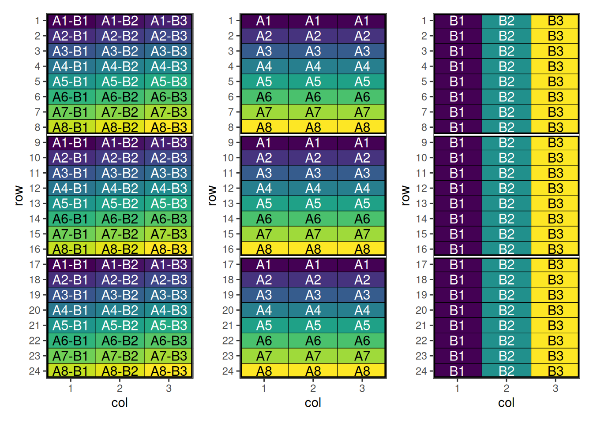
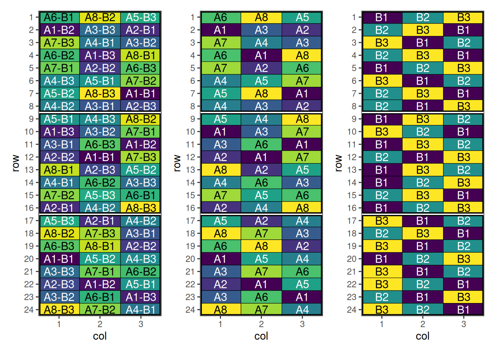

# Factorial Design with speed

## Factorial Design

### Overview

Factorial designs are experimental designs used to study the effects of
two or more factors simultaneously. They allow estimation of main
effects and interactions between factors, making them efficient and
informative.

``` r

library(speed)
library(patchwork)
```

### When to Use

- Studying multiple factors at the same time
- Detecting interactions between factors
- Efficient use of experimental units

### Setting Up Factorial Design with speed

Now we can create a data frame representing a factorial design. Note
that the treatment column we are creating is the interaction (or
combination) of the individual treatments.

``` r

treatment_a <- paste0("A", 1:8)
treatment_b <- paste0("B", 1:3)
treatments <- with(expand.grid(treatment_a, treatment_b), paste(Var1, Var2, sep = "-"))
factorial_design <- initialise_design_df(treatments, 24, 3, 8, 3)

head(factorial_design)
```

      row col treatment row_block col_block block
    1   1   1     A1-B1         1         1     1
    2   2   1     A2-B1         1         1     1
    3   3   1     A3-B1         1         1     1
    4   4   1     A4-B1         1         1     1
    5   5   1     A5-B1         1         1     1
    6   6   1     A6-B1         1         1     1

Plotting these factors shows the initial layout of the interaction and
main effects.



#### Performing the Optimisation

For factorial designs, speed provides a customised objective function
`objective_function_factorial` which allows us to pass
`interaction_weight` and `main_weight` arguments to control the spatial
balance of those effects. The `optimise_params` argument is also used in
this case to adjust the optimisation strategy due to the difficulty of
optimising such designs.

Make sure `factorial_separator` matches how you constructed the
interaction treatment (here we used `"-"`). If your treatments use a
different separator (e.g. `"A1:B2"`), pass `factorial_separator = ":"`.

``` r

optimise_params <- optim_params(
  swap_count = 3,
  random_initialisation = 10,
  adaptive_swaps = TRUE,
  swap_all_blocks = TRUE,
  cooling_rate = 0.999
)

factorial_result <- speed(
  data = factorial_design,
  swap = "treatment",
  swap_within = "block",
  spatial_factors = ~ row + col,
  obj_function = objective_function_factorial,
  optimise_params = optimise_params,
  early_stop_iterations = 10000,
  iterations = 200000,
  interaction_weight = 10,
  seed = 112
)
```

    row and col are used as row and column, respectively.

    Optimising level: single treatment within block
    Level: single treatment within block Iteration: 1000 Score: 158.118 Best: 105.3975 Since Improvement: 174
    Level: single treatment within block Iteration: 2000 Score: 123.3043 Best: 105.3975 Since Improvement: 1174
    Level: single treatment within block Iteration: 3000 Score: 121.795 Best: 100.6957 Since Improvement: 261
    Level: single treatment within block Iteration: 4000 Score: 104.8199 Best: 93.92547 Since Improvement: 202
    Level: single treatment within block Iteration: 5000 Score: 65.14907 Best: 58.38509 Since Improvement: 140
    Level: single treatment within block Iteration: 6000 Score: 51.15528 Best: 51.15528 Since Improvement: 89
    Level: single treatment within block Iteration: 7000 Score: 42.10559 Best: 42.10559 Since Improvement: 381
    Level: single treatment within block Iteration: 8000 Score: 40.81988 Best: 40.81988 Since Improvement: 501
    Level: single treatment within block Iteration: 9000 Score: 39.81988 Best: 39.81988 Since Improvement: 742
    Level: single treatment within block Iteration: 10000 Score: 36.81988 Best: 36.81988 Since Improvement: 537
    Level: single treatment within block Iteration: 11000 Score: 36.81988 Best: 36.81988 Since Improvement: 1537
    Level: single treatment within block Iteration: 12000 Score: 36.81988 Best: 36.81988 Since Improvement: 2537
    Level: single treatment within block Iteration: 13000 Score: 36.81988 Best: 36.81988 Since Improvement: 3537
    Level: single treatment within block Iteration: 14000 Score: 36.81988 Best: 36.81988 Since Improvement: 4537
    Level: single treatment within block Iteration: 15000 Score: 36.81988 Best: 36.81988 Since Improvement: 5537
    Level: single treatment within block Iteration: 16000 Score: 36.81988 Best: 36.81988 Since Improvement: 6537
    Level: single treatment within block Iteration: 17000 Score: 36.81988 Best: 36.81988 Since Improvement: 7537
    Level: single treatment within block Iteration: 18000 Score: 36.81988 Best: 36.81988 Since Improvement: 8537
    Level: single treatment within block Iteration: 19000 Score: 36.81988 Best: 36.81988 Since Improvement: 9537
    Early stopping at iteration 19463 for level single treatment within block 

``` r

factorial_result
```

    Optimised Experimental Design
    ----------------------------
    Score: 36.81988
    Iterations Run: 19464
    Stopped Early: TRUE
    Treatments: A1-B1, A1-B2, A1-B3, A2-B1, A2-B2, A2-B3, A3-B1, A3-B2, A3-B3, A4-B1, A4-B2, A4-B3, A5-B1, A5-B2, A5-B3, A6-B1, A6-B2, A6-B3, A7-B1, A7-B2, A7-B3, A8-B1, A8-B2, A8-B3
    Seed: 112 

#### Output of the Optimisation

The output summarises the optimisation of the factorial **interaction**
treatment (e.g. `"A1-B2"`) across the spatial layout. The reported score
is for the whole design after optimisation, and the returned `design_df`
contains the updated treatment allocation.

Because the treatment column encodes multiple factors, it can be helpful
to split it back into its component factors (e.g. `treatment_a` and
`treatment_b`) when inspecting the result. This lets you check whether
the optimisation improved not only the interaction layout, but also the
balance/adjacency patterns of the main effects.

``` r

str(factorial_result)
```

    List of 8
     $ design_df     :Classes 'design' and 'data.frame':    72 obs. of  8 variables:
      ..$ row        : int [1:72] 1 1 1 2 2 2 3 3 3 4 ...
      ..$ col        : int [1:72] 1 2 3 1 2 3 1 2 3 1 ...
      ..$ treatment  : chr [1:72] "A6-B1" "A8-B2" "A5-B3" "A1-B2" ...
      ..$ row_block  : num [1:72] 1 1 1 1 1 1 1 1 1 1 ...
      ..$ col_block  : num [1:72] 1 1 1 1 1 1 1 1 1 1 ...
      ..$ block      : num [1:72] 1 1 1 1 1 1 1 1 1 1 ...
      ..$ treatment_a: chr [1:72] "A1" "A1" "A1" "A2" ...
      ..$ treatment_b: chr [1:72] "B1" "B2" "B3" "B1" ...
      ..- attr(*, "out.attrs")=List of 2
      .. ..$ dim     : Named int [1:2] 24 3
      .. .. ..- attr(*, "names")= chr [1:2] "row" "col"
      .. ..$ dimnames:List of 2
      .. .. ..$ row: chr [1:24] "row= 1" "row= 2" "row= 3" "row= 4" ...
      .. .. ..$ col: chr [1:3] "col=1" "col=2" "col=3"
     $ score         : num 36.8
     $ scores        : num [1:19464] 131 141 139 141 153 ...
     $ temperatures  : num [1:19464] 100 99.9 99.8 99.7 99.6 ...
     $ iterations_run: num 19464
     $ stopped_early : logi TRUE
     $ treatments    : chr [1:24] "A1-B1" "A1-B2" "A1-B3" "A2-B1" ...
     $ seed          : num 112
     - attr(*, "class")= chr [1:2] "design" "list"

#### Visualise the Output

``` r

treatments <- strsplit(as.character(factorial_result$design_df$treatment), "-") |>
  unlist() |>
  matrix(ncol = 2, byrow = TRUE)
factorial_result$design_df[c("treatment_a", "treatment_b")] <- treatments

pa <- autoplot(factorial_result, treatments = "treatment_a")
pb <- autoplot(factorial_result, treatments = "treatment_b")
p <- autoplot(factorial_result)
p + pa + pb + plot_layout(ncol = 3)
```



This design has now been optimised for both main and interaction
effects.

## Spatial Design Considerations

### Field Shape and Orientation

### Neighbour Effects

## Using `speed` Effectively

1.  **Set appropriate parameters**: Balance optimisation time with
    improvement
2.  **[Visualise
    designs](https://biometryhub.github.io/speed/articles/autoplot.md)**:
    Always plot layouts before implementation
3.  **Compare alternatives**: Test multiple blocking strategies
4.  **Validate results**: Check constraint satisfaction and efficiency
    factors

## Conclusion

### Further Reading

## Related Vignettes

*This vignette demonstrates the versatility of the `speed` package for
agricultural experimental design. For more advanced applications and
custom designs, consult the package documentation and additional
vignettes.*
