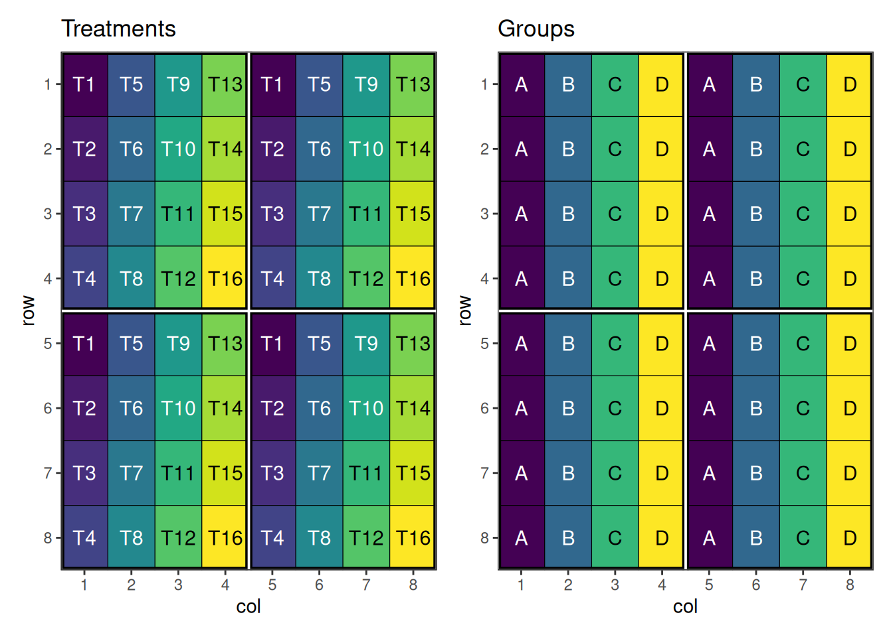
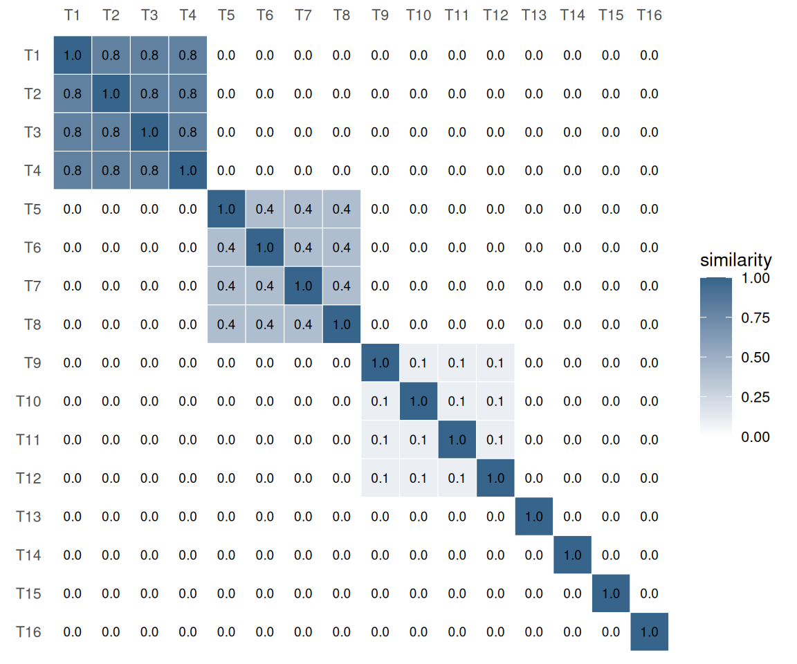
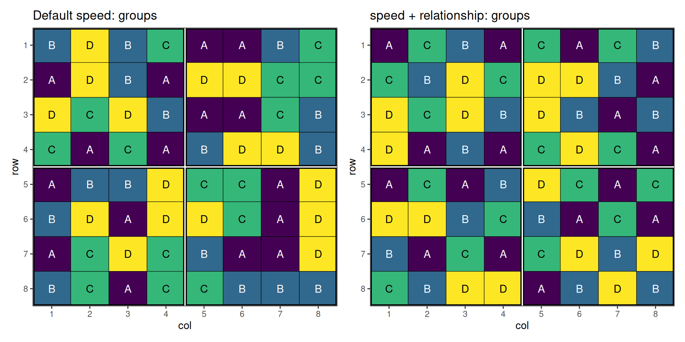
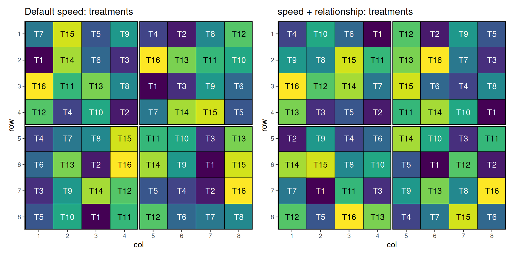
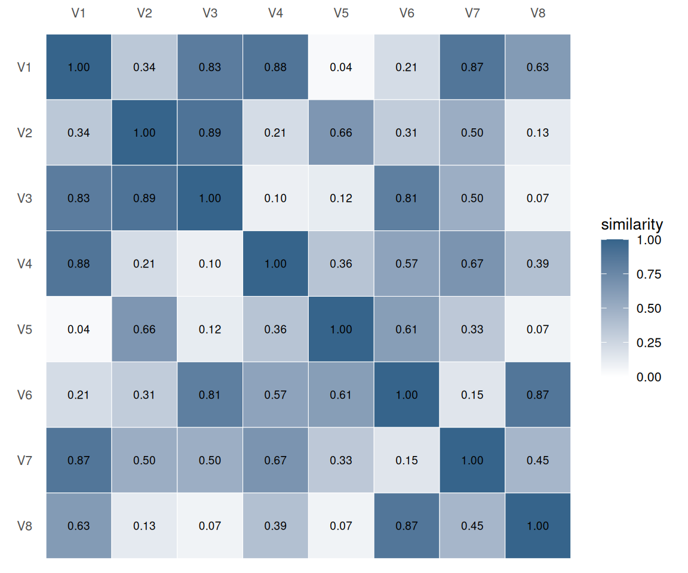
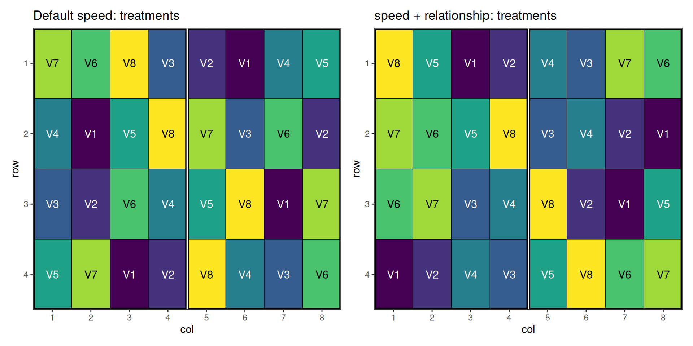
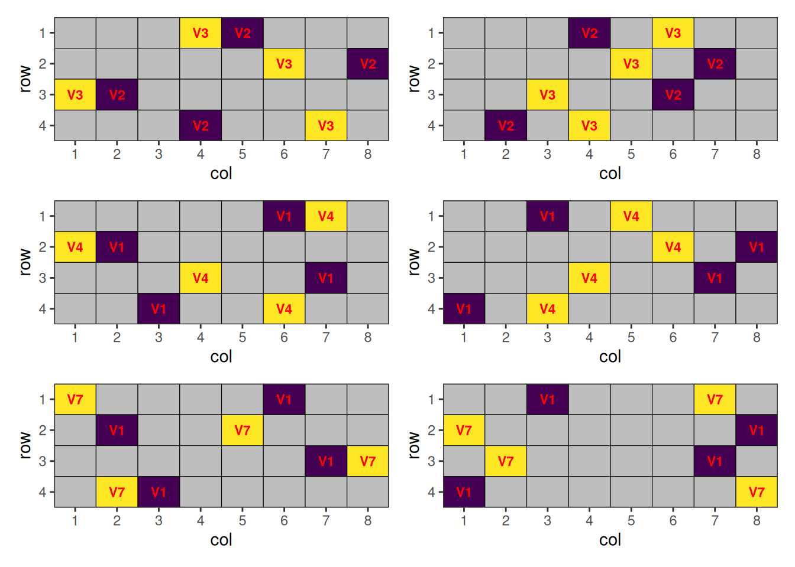

# Relationship-Aware Adjacency in speed

## Design with Relationship Matrix

### Overview

The default `speed` adjacency score asks *“are these two cells the same
treatment?”*. Pairs that match contribute `1`; pairs that differ
contribute `0`. Sometimes that’s too coarse: two distinct treatments may
still be “close” to each other, and placing them next to each other
carries some of the cost of a true repeat.

The `relationship` argument lets the simulated-annealing loop look up a
graded similarity from a user-supplied matrix instead of hard-coding `1`
for matches and `0` for non-matches. This vignette walks through a
blocked design with sixteen treatments split into four groups whose
within-group relatedness varies from “tightly related” to “unrelated”.

``` r

library(speed)
library(patchwork)
```

### When to Use

- Trials where treatments fall into clusters of close relatives - for
  example plant-breeding lines that share parents (encoded via a
  pedigree A-matrix or marker-based G-matrix), variety entries from the
  same maturity group, or scaled mixtures of a base formulation
- Anywhere “minimise neighbours of the same kind” is too coarse and you
  would rather “minimise neighbours of related kind”

## Grouped Treatments

### Setting Up the Design

Sixteen treatments `T01`–`T16` are organised into four groups of four:

| Group | Treatments | Within-group similarity |
|------:|:-----------|------------------------:|
|   `A` | `T01–T04`  | `0.8` (tightly related) |
|   `B` | `T05–T08`  |        `0.4` (moderate) |
|   `C` | `T09–T12`  |           `0.1` (loose) |
|   `D` | `T13–T16`  |       `0.0` (unrelated) |

The trial uses an `8 × 8` grid divided into four `4 × 4` blocks.

``` r

items <- paste0("T", 1:16)
groups <- setNames(rep(c("A", "B", "C", "D"), each = 4), items)

design_df <- initialise_design_df(
  items = rep(items, 4),
  nrows = 8,
  ncols = 8,
  block_nrows = 4,
  block_ncols = 4
)
design_df$group <- groups[design_df$treatment]

head(design_df)
```

      row col treatment row_block col_block block group
    1   1   1        T1         1         1     1     A
    2   2   1        T2         1         1     1     A
    3   3   1        T3         1         1     1     A
    4   4   1        T4         1         1     1     A
    5   5   1        T1         2         1     2     A
    6   6   1        T2         2         1     2     A

Plotting these factors shows the initial layout of the treatments and
their group.

Code

``` r

class(design_df) <- c("design", class(design_df))
p_treat <- autoplot(design_df, treatments = "treatment") +
  ggplot2::labs(title = "Treatments")
p_group <- autoplot(design_df, treatments = "group") +
  ggplot2::labs(title = "Groups")
p_treat + p_group + plot_layout(ncol = 2)
```



Figure 1: Initial systematic layout: treatments and groups, with block
boundaries.

### Building the Relationship Matrix

The relationship matrix is a numeric matrix with rownames and colnames
covering every value of the swap column. Each entry is the contribution
of having that pair adjacent. The diagonal is typically `1` (self-pair =
identity). Off-diagonal entries are usually in `[0, 1]`; here we encode
four within-group levels and zero between-group similarity.

``` r

n <- length(items)
rel <- matrix(0, n, n, dimnames = list(items, items))
within <- c(A = 0.8, B = 0.4, C = 0.1, D = 0.0)
for (g in names(within)) {
  ids <- items[groups == g]
  rel[ids, ids] <- within[[g]]
}
diag(rel) <- 1
```

Code

``` r

rel_long <- as.data.frame.table(rel, responseName = "value")
names(rel_long)[1:2] <- c("row", "col")

ggplot2::ggplot(rel_long, ggplot2::aes(x = col, y = row, fill = value)) +
  ggplot2::geom_tile(colour = "white") +
  ggplot2::geom_text(
    ggplot2::aes(label = sprintf("%.1f", value)),
    size = 2.5
  ) +
  ggplot2::scale_x_discrete(position = "top") +
  ggplot2::scale_y_discrete(limits = rev(rownames(rel))) +
  ggplot2::scale_fill_gradient(
    low = "white", high = "steelblue4", limits = c(0, 1),
    name = "similarity"
  ) +
  ggplot2::coord_equal() +
  ggplot2::labs(x = NULL, y = NULL) +
  ggplot2::theme_minimal(base_size = 10) +
  ggplot2::theme(panel.grid = ggplot2::element_blank())
```



Figure 2: Relationship matrix as a heatmap. Diagonal cells are
self-pairs (`1`); each `4 × 4` block on the diagonal corresponds to a
group, with brightness encoding within-group similarity.

### Running the Optimisation

We run
[`speed()`](https://biometryhub.github.io/speed/reference/speed.md)
twice with the same seed: first using the default identity-only
adjacency, then with the relationship matrix (`relationship = rel`).

``` r

default_result <- speed(
  design_df,
  swap = "treatment",
  swap_within = "block",
  seed = 42,
  quiet = TRUE
)

related_result <- speed(
  design_df,
  swap = "treatment",
  swap_within = "block",
  relationship = rel,
  seed = 42,
  quiet = TRUE
)

default_result
```

    Optimised Experimental Design
    ----------------------------
    Score: 4.266667
    Iterations Run: 2872
    Stopped Early: TRUE
    Treatments: T1, T2, T3, T4, T5, T6, T7, T8, T9, T10, T11, T12, T13, T14, T15, T16
    Seed: 42 

``` r

related_result
```

    Optimised Experimental Design
    ----------------------------
    Score: 4.266667
    Iterations Run: 3511
    Stopped Early: TRUE
    Treatments: T1, T2, T3, T4, T5, T6, T7, T8, T9, T10, T11, T12, T13, T14, T15, T16
    Seed: 42 

### Visualising the Output

Code

``` r

default_result$design_df$group <- groups[default_result$design_df$treatment]
related_result$design_df$group <- groups[related_result$design_df$treatment]

p_def_g <- autoplot(default_result, treatments = "group") +
  ggplot2::labs(title = "Default speed: groups")
p_rel_g <- autoplot(related_result, treatments = "group") +
  ggplot2::labs(title = "speed + relationship: groups")
p_def_g + p_rel_g + plot_layout(ncol = 2)
```



Figure 3: Group view: default identity-only adjacency
vs. relationship-aware adjacency.

Code

``` r

p_def_t <- autoplot(default_result, treatments = "treatment") +
  ggplot2::labs(title = "Default speed: treatments")
p_rel_t <- autoplot(related_result, treatments = "treatment") +
  ggplot2::labs(title = "speed + relationship: treatments")
p_def_t + p_rel_t + plot_layout(ncol = 2)
```



Figure 4: Treatment view: default identity-only adjacency
vs. relationship-aware adjacency.

The default optimisation only avoids same-treatment adjacency; related
treatments from the same group are still free to sit next to each other.
The relationship-aware optimisation pushes whole groups apart, with the
strongest pressure on group `A` (within-similarity `0.8`) and no
pressure at all on group `D` (`0.0`).

## Per-Pair Similarities

### Setting Up the Design

Eight varieties `V01`–`V08` are evaluated on a `4 × 8` grid divided into
two `4 × 4` blocks, with two replicates of every variety per block.
Unlike the previous example, there is no group structure - every pair of
varieties carries its own similarity coefficient.

``` r

items2 <- paste0("V", 1:8)
design_df2 <- initialise_design_df(
  items = rep(items2, 4),
  nrows = 4,
  ncols = 8,
  block_nrows = 4,
  block_ncols = 4
)

head(design_df2)
```

      row col treatment row_block col_block block
    1   1   1        V1         1         1     1
    2   2   1        V2         1         1     1
    3   3   1        V3         1         1     1
    4   4   1        V4         1         1     1
    5   1   2        V5         1         1     1
    6   2   2        V6         1         1     1

### Building the Relationship Matrix

We populate the upper triangle with random similarities in `[0, 0.9]`,
mirror it for symmetry, and pin the diagonal to `1`. The result is a
relationship matrix in which every off-diagonal entry is distinct -
there is no plateau for the optimiser to exploit, so each pair
contributes its own adjacency cost.

``` r

n_v <- length(items2)

rel2 <- matrix(0, n_v, n_v, dimnames = list(items2, items2))
set.seed(112)
rel2[upper.tri(rel2)] <- runif(n_v * (n_v - 1) / 2, min = 0, max = 0.9)
rel2 <- rel2 + t(rel2)
diag(rel2) <- 1
```

Code

``` r

rel2_long <- as.data.frame.table(rel2, responseName = "value")
names(rel2_long)[1:2] <- c("row", "col")

ggplot2::ggplot(rel2_long, ggplot2::aes(x = col, y = row, fill = value)) +
  ggplot2::geom_tile(colour = "white") +
  ggplot2::geom_text(
    ggplot2::aes(label = sprintf("%.2f", value)),
    size = 2.5
  ) +
  ggplot2::scale_x_discrete(position = "top") +
  ggplot2::scale_y_discrete(limits = rev(rownames(rel2))) +
  ggplot2::scale_fill_gradient(
    low = "white", high = "steelblue4", limits = c(0, 1),
    name = "similarity"
  ) +
  ggplot2::coord_equal() +
  ggplot2::labs(x = NULL, y = NULL) +
  ggplot2::theme_minimal(base_size = 10) +
  ggplot2::theme(panel.grid = ggplot2::element_blank())
```



Figure 5: Per-pair relationship matrix as a heatmap. Every off-diagonal
cell is unique; the diagonal is fixed at `1`.

### Running the Optimisation

We run
[`speed()`](https://biometryhub.github.io/speed/reference/speed.md)
twice with the same seed: first using the default identity-only
adjacency, then with the per-pair relationship matrix
(`relationship = rel2`) and a stronger balance weight set through
[`optim_params()`](https://biometryhub.github.io/speed/reference/optim_params.md).

``` r

default_result2 <- speed(
  design_df2,
  swap = "treatment",
  swap_within = "block",
  seed = 112,
  quiet = TRUE
)

related_result2 <- speed(
  design_df2,
  swap = "treatment",
  swap_within = "block",
  relationship = rel2,
  optimise_params = optim_params(bal_weight = 2),
  seed = 112,
  quiet = TRUE
)

default_result2
```

    Optimised Experimental Design
    ----------------------------
    Score: 2.285714
    Iterations Run: 2758
    Stopped Early: TRUE
    Treatments: V1, V2, V3, V4, V5, V6, V7, V8
    Seed: 112 

``` r

related_result2
```

    Optimised Experimental Design
    ----------------------------
    Score: 16.30073
    Iterations Run: 3435
    Stopped Early: TRUE
    Treatments: V1, V2, V3, V4, V5, V6, V7, V8
    Seed: 112 

### Visualising the Output

Code

``` r

p_def_t2 <- autoplot(default_result2, treatments = "treatment") +
  ggplot2::labs(title = "Default speed: treatments")
p_rel_t2 <- autoplot(related_result2, treatments = "treatment") +
  ggplot2::labs(title = "speed + relationship: treatments")
p_def_t2 + p_rel_t2 + plot_layout(ncol = 2)
```



Figure 6: Treatment view: default identity-only adjacency
vs. relationship-aware adjacency under per-pair similarities.

The default optimisation treats every non-self adjacency as equally
costly. With a relationship matrix, the algorithm can separate the
similar varieties - neighbours of any given variety tend to be the
varieties with the smallest entries in its row of `rel2`.

The placements of the closely related pairs of treatments:

Code

``` r

# Plot a layout where cells with NA treatments are greyed and the rest
# are labelled in red.
plot_highlighted_layout <- function(layout_df) {
  x_breaks <- 1:max(layout_df$col)
  y_breaks <- 1:max(layout_df$row)
  ggplot2::ggplot(layout_df, ggplot2::aes(col, row, fill = treatment)) +
    ggplot2::geom_tile(color = "black") +
    ggplot2::scale_fill_viridis_d(na.value = "grey") +
    ggplot2::scale_x_continuous(expand = c(0, 0), breaks = x_breaks) +
    ggplot2::scale_y_continuous(expand = c(0, 0), breaks = y_breaks, trans = scales::reverse_trans()) +
    ggplot2::geom_text(
      ggplot2::aes(label = treatment),
      size = 3,
      color = "red",
      na.rm = TRUE,
      fontface = "bold"
    ) +
    ggplot2::theme_bw() +
    ggplot2::theme(
      panel.grid.major = ggplot2::element_blank(),
      panel.grid.minor = ggplot2::element_blank(),
      legend.position = "none"
    )
}

ut <- which(upper.tri(rel2), arr.ind = TRUE)
top_orders <- order(rel2[upper.tri(rel2)], decreasing = TRUE)
plots <- NULL
for (i in 1:3) {
  top <- ut[top_orders[i], , drop = FALSE]
  close_treatments <- unique(c(
    rownames(rel2)[top[, "row"]],
    colnames(rel2)[top[, "col"]]
  ))

  df_def <- default_result2$design_df
  df_def$treatment <- ifelse(df_def$treatment %in% close_treatments, as.character(df_def$treatment), NA)

  df <- related_result2$design_df
  df$treatment <- ifelse(df$treatment %in% close_treatments, as.character(df$treatment), NA)

  hl_def <- plot_highlighted_layout(df_def)
  hl_rel <- plot_highlighted_layout(df)
  if (is.null(plots)) {
    plots <- hl_def + hl_rel
  } else {
    plots <- plots + hl_def + hl_rel
  }
}
plots + plot_layout(ncol = 2)
```



Figure 7: Optimised layout. Only varieties involved in the
high-similarity pairs are shown.

Without a relationship matrix, these related treatments can be placed
next to each other. This can be optimised by providing such matrix.

## Related Vignettes

- [Common Agricultural Experimental Designs with
  speed](https://biometryhub.github.io/speed/articles/speed.md) -
  foundational designs and the default optimisation flow.
- [Custom Objective Functions and Advanced Options for Optimisation in
  speed](https://biometryhub.github.io/speed/articles/custom_objective_functions.md) -
  for cases where weighted-relationship adjacency is one of several
  competing objectives.
- [Multi-Environment Trials with
  speed](https://biometryhub.github.io/speed/articles/met.md) - how the
  same workflow extends to hierarchical layouts.

------------------------------------------------------------------------

*This vignette demonstrates the `relationship` argument added to
[`calculate_adjacency_score()`](https://biometryhub.github.io/speed/reference/calculate_adjacency_score.md)
and [`speed()`](https://biometryhub.github.io/speed/reference/speed.md).
For other features of the package, consult the documentation and
additional vignettes.*
