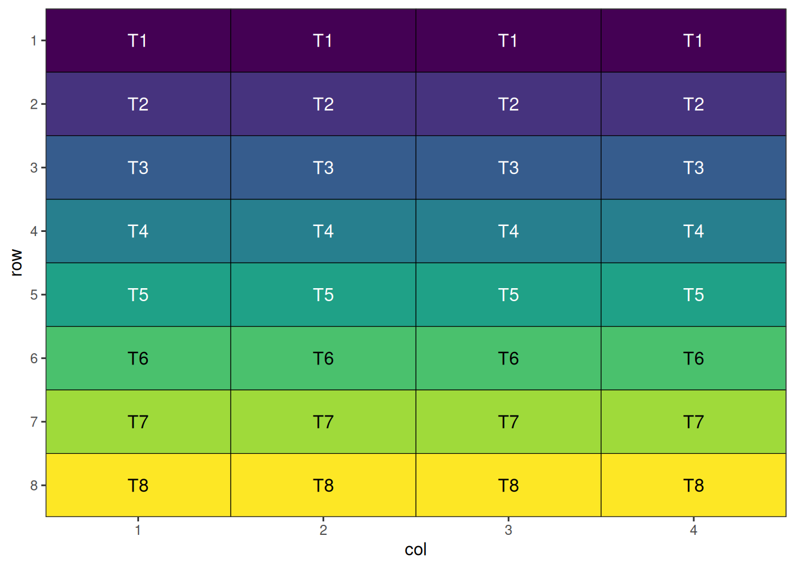
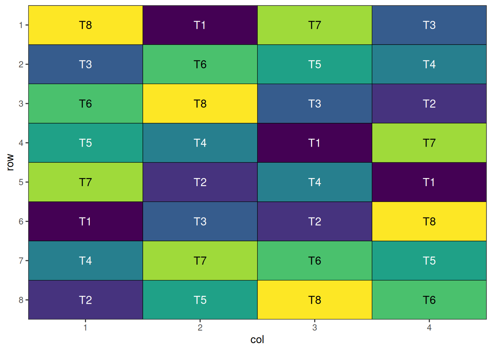
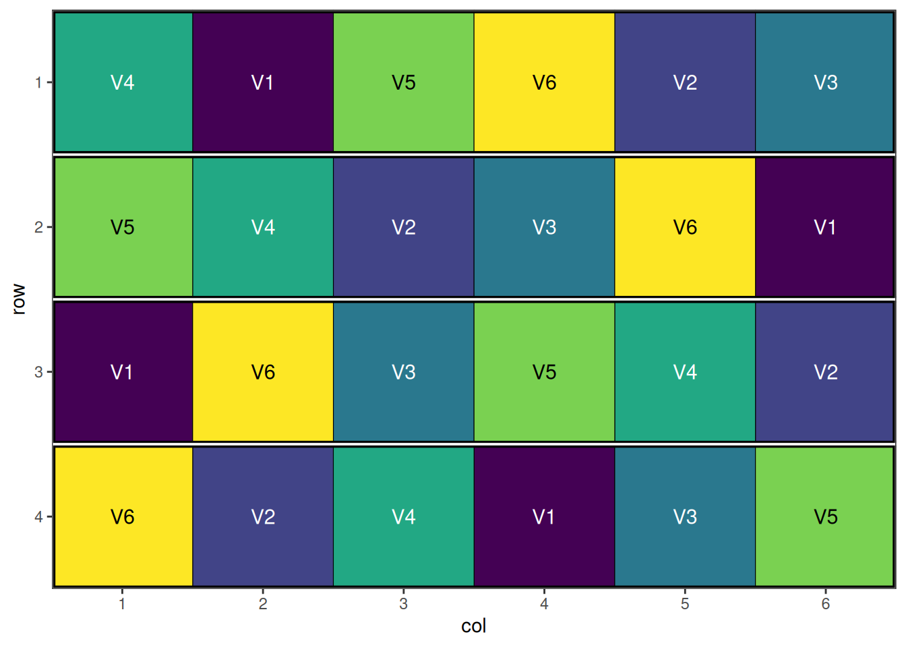
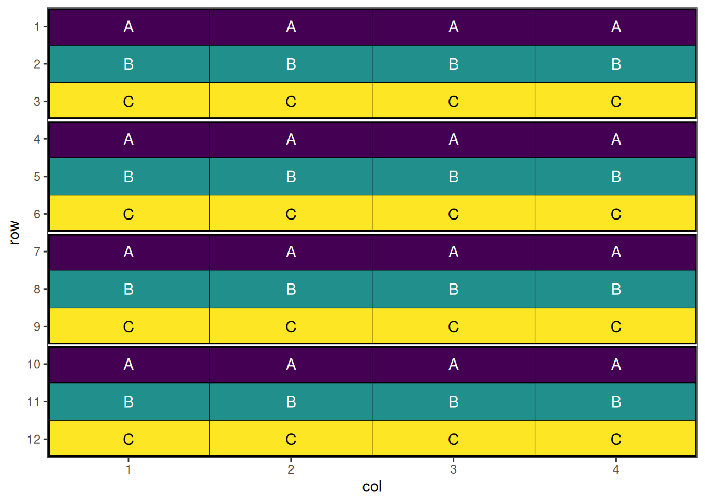
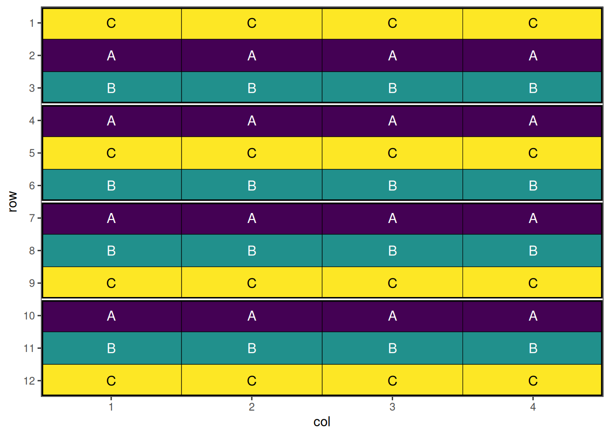

# Common Agricultural Experimental Designs with speed

## Introduction

Agricultural experiments require careful spatial design to minimise the
effects of field heterogeneity and neighbour interactions while
maximising statistical power. The `speed` package provides tools for
creating spatially efficient experimental designs through simulated
annealing optimisation.

This vignette demonstrates how to use `speed` for common agricultural
experimental designs, showing how spatial optimisation can improve the
efficiency and validity of field trials. We’ll work through four key
design types, each building in complexity and showing different features
of the package.

For advanced and specialised experimental designs (e.g., split-split
plot, strip-plot, incomplete block, p-rep, and more), see the companion
vignette: [Complex Agricultural Experimental Designs with
speed](https://biometryhub.github.io/speed/articles/complex_designs.md).

``` r
library(speed)
```

## Completely Randomised Design (CRD)

### Overview

The Completely Randomised Design is the simplest experimental design
where treatments are assigned to experimental units entirely at random.
While simple to implement, a CRD doesn’t account for spatial variation
in field conditions, which can be mitigated by spatial optimisation
techniques.

### When to Use

- Homogeneous experimental conditions
- Controlled environments (greenhouse, growth chamber)
- Small-scale experiments with minimal spatial variation
- Proof-of-concept studies

### Example: Field Trial with 8 Varieties

Consider a field trial testing 8 new wheat varieties with 4 replicates
each. Even though treatments are assigned randomly, spatial optimisation
can reduce neighbour effects and improve precision.

### Setting Up CRD with speed

In agricultural contexts, even completely randomised designs benefit
from spatial optimisation to minimise treatment clustering and neighbour
effects. Firstly we will initialise a data frame representing the design
and visualise it. This design has 4 replicates of 8 treatments or
`items`, with 8 rows and 4 columns.

``` r
# Initialise data frame
crd_design <- initialise_design_df(items = 8, nrows = 8, ncols = 4)
head(crd_design)
```

      row col treatment
    1   1   1        T1
    2   2   1        T2
    3   3   1        T3
    4   4   1        T4
    5   5   1        T5
    6   6   1        T6



This is a systematic layout; note how the initial layout arranges
treatments in a repeating, non-random pattern. This will now be
randomised before visualisation.

#### Performing the Optimisation

The main
[`speed()`](https://biometryhub.github.io/speed/reference/speed.md)
function performs the optimisation. It has been set up with sensible
defaults to allow application to a wide variety of situations. In this
case, we only need to provide the design data frame for it to operate
on, the column name of the data frame to use for the treatments, and a
seed for reproducibility.

``` r
crd_result <- speed(crd_design, 
                    swap = "treatment",
                    seed = 42)
```

    row and col are used as row and column, respectively.

    Optimising level: single treatment within whole design
    Level: single treatment within whole design Iteration: 1000 Score: 2.285714 Best: 2.285714 Since Improvement: 271
    Level: single treatment within whole design Iteration: 2000 Score: 2.285714 Best: 2.285714 Since Improvement: 1271
    Early stopping at iteration 2729 for level single treatment within whole design 

``` r
crd_result
```

    Optimised Experimental Design
    ----------------------------
    Score: 2.285714
    Iterations Run: 2730
    Stopped Early: TRUE
    Treatments: T1, T2, T3, T4, T5, T6, T7, T8
    Seed: 42 

#### Output of the Optimisation

The printed output from the returned design object shows the final
optimisation score (lower is better), the number of iterations taken to
reach that result, if the iterations stopped early due to lack of
improvement, the treatments present in the design, and the seed. The
output object contains some additional components, which can be seen
below:

``` r
str(crd_result)
```

    List of 8
     $ design_df     :Classes 'design' and 'data.frame':    32 obs. of  3 variables:
      ..$ row      : int [1:32] 1 1 1 1 2 2 2 2 3 3 ...
      ..$ col      : int [1:32] 1 2 3 4 1 2 3 4 1 2 ...
      ..$ treatment: chr [1:32] "T8" "T1" "T7" "T3" ...
      ..- attr(*, "out.attrs")=List of 2
      .. ..$ dim     : Named int [1:2] 8 4
      .. .. ..- attr(*, "names")= chr [1:2] "row" "col"
      .. ..$ dimnames:List of 2
      .. .. ..$ row: chr [1:8] "row=1" "row=2" "row=3" "row=4" ...
      .. .. ..$ col: chr [1:4] "col=1" "col=2" "col=3" "col=4"
     $ score         : num 2.29
     $ scores        : num [1:2730] 40 36.3 32.4 28.3 24.1 ...
     $ temperatures  : num [1:2730] 100 99 98 97 96.1 ...
     $ iterations_run: num 2730
     $ stopped_early : logi TRUE
     $ treatments    : chr [1:8] "T1" "T2" "T3" "T4" ...
     $ seed          : num 42
     - attr(*, "class")= chr [1:2] "design" "list"

#### Visualise the Output

The final step is to visualise the optimised design. The plot below
displays the spatial arrangement of treatments after optimisation,
allowing you to easily check for clustering, spatial trends, or other
patterns that may affect your experiment. A well-randomised and
spatially efficient design will show treatments distributed evenly
across the field, helping to minimise neighbour effects and maximise the
reliability of your results.

``` r
autoplot(crd_result)
```



A nicely randomised[¹](#fn1) and spatially optimal design!

## Randomised Complete Block Design (RCBD)

### Overview

RCBD is one of the most commonly used designs in agricultural research.
It controls for one source of variation by grouping experimental units
into homogeneous blocks, with each treatment appearing once per block.

### When to Use

- Field experiments with known gradient (slope, soil type, irrigation)
- Medium to large experiments (3+ treatments)
- When blocking factor explains significant variation
- Multi-location trials

### Example: Variety Trial Across Field Gradient

Consider testing 6 barley varieties across a field with a moisture
gradient. Using 4 blocks perpendicular to the gradient helps control for
soil moisture variation.

### Setting Up RCBD with speed

Here we initialise a data frame for a design with 4 blocks and 6
treatments, arranged in 4 rows and 6 columns. Note that we can specify
treatments in the `items` argument.

``` r
rcbd_design <- initialise_design_df(items = paste0("V", 1:6), nrows = 4, ncols = 6, block_nrows = 1, block_ncols = 6)
head(rcbd_design)
```

      row col treatment row_block col_block block
    1   1   1        V1         1         1     1
    2   2   1        V1         2         1     2
    3   3   1        V1         3         1     3
    4   4   1        V1         4         1     4
    5   1   2        V2         1         1     1
    6   2   2        V2         2         1     2


This is a systematic block layout; each block contains all treatments in
a repeating pattern. This will now be randomised within blocks.

#### Performing the Optimisation

``` r
rcbd_result <- speed(rcbd_design, 
                     swap = "treatment",
                     swap_within = "block",
                     seed = 42)
```

    row and col are used as row and column, respectively.

    Optimising level: single treatment within block
    Level: single treatment within block Iteration: 1000 Score: 1.6 Best: 1.6 Since Improvement: 672
    Level: single treatment within block Iteration: 2000 Score: 1.6 Best: 1.6 Since Improvement: 1672
    Early stopping at iteration 2328 for level single treatment within block 

``` r
rcbd_result
```

    Optimised Experimental Design
    ----------------------------
    Score: 1.6
    Iterations Run: 2329
    Stopped Early: TRUE
    Treatments: V1, V2, V3, V4, V5, V6
    Seed: 42 

#### Output of the Optimisation

``` r
str(rcbd_result)
```

    List of 8
     $ design_df     :Classes 'design' and 'data.frame':    24 obs. of  6 variables:
      ..$ row      : int [1:24] 1 1 1 1 1 1 2 2 2 2 ...
      ..$ col      : int [1:24] 1 2 3 4 5 6 1 2 3 4 ...
      ..$ treatment: chr [1:24] "V4" "V1" "V5" "V6" ...
      ..$ row_block: num [1:24] 1 1 1 1 1 1 2 2 2 2 ...
      ..$ col_block: num [1:24] 1 1 1 1 1 1 1 1 1 1 ...
      ..$ block    : num [1:24] 1 1 1 1 1 1 2 2 2 2 ...
      ..- attr(*, "out.attrs")=List of 2
      .. ..$ dim     : Named int [1:2] 4 6
      .. .. ..- attr(*, "names")= chr [1:2] "row" "col"
      .. ..$ dimnames:List of 2
      .. .. ..$ row: chr [1:4] "row=1" "row=2" "row=3" "row=4"
      .. .. ..$ col: chr [1:6] "col=1" "col=2" "col=3" "col=4" ...
     $ score         : num 1.6
     $ scores        : num [1:2329] 34 29.6 25.2 21.6 18.4 16.2 13 12.2 8.6 10.4 ...
     $ temperatures  : num [1:2329] 100 99 98 97 96.1 ...
     $ iterations_run: num 2329
     $ stopped_early : logi TRUE
     $ treatments    : chr [1:6] "V1" "V2" "V3" "V4" ...
     $ seed          : num 42
     - attr(*, "class")= chr [1:2] "design" "list"

#### Visualise the Output

``` r
autoplot(rcbd_result)
```



A well-randomised and spatially efficient RCBD layout.

## Latin Square Design

### Overview

Latin Square Design controls for two sources of variation simultaneously
by arranging treatments in a square grid where each treatment appears
exactly once in each row and column.

### When to Use

- Small to medium experiments (3-10 treatments)
- Two known sources of variation (e.g., row and column effects)
- Greenhouse bench experiments
- Field experiments with two-way gradients

### Constraints

- Number of treatments must equal number of rows and columns
- Limited degrees of freedom for error
- Assumes no row × column interaction

### Setting Up Latin Square with speed

Here we initialise a 5 × 5 Latin square with 5 treatments.

``` r
latin_square_design <- initialise_design_df(items = 5, nrows = 5, ncols = 5)
head(latin_square_design)
```

      row col treatment
    1   1   1        T1
    2   2   1        T2
    3   3   1        T3
    4   4   1        T4
    5   5   1        T5
    6   1   2        T1


This is a systematic Latin square layout; each treatment appears once
per row and column. The design will now be randomised.

#### Performing the Optimisation

Because of the spatial optimisation algorithm built into `speed`, with
default optimization parameters and enough iterations, it should arrive
at a Latin square design in cases where the number of rows, columns,
treatments and replicates are all equal such as this.

``` r
latin_square_result <- speed(latin_square_design, 
                             swap = "treatment",
                             seed = 42)
```

    row and col are used as row and column, respectively.

    Optimising level: single treatment within whole design
    Level: single treatment within whole design Iteration: 1000 Score: 1 Best: 1 Since Improvement: 308
    Early stopping at iteration 1040 for level single treatment within whole design 

``` r
latin_square_result
```

    Optimised Experimental Design
    ----------------------------
    Score: 0
    Iterations Run: 1041
    Stopped Early: TRUE
    Treatments: T1, T2, T3, T4, T5
    Seed: 42 

#### Output of the Optimisation

Note that the final score of zero shows that the algorithm has found a
perfect Latin Square solution.

``` r
str(latin_square_result)
```

    List of 8
     $ design_df     :Classes 'design' and 'data.frame':    25 obs. of  3 variables:
      ..$ row      : int [1:25] 1 1 1 1 1 2 2 2 2 2 ...
      ..$ col      : int [1:25] 1 2 3 4 5 1 2 3 4 5 ...
      ..$ treatment: chr [1:25] "T3" "T2" "T5" "T1" ...
      ..- attr(*, "out.attrs")=List of 2
      .. ..$ dim     : Named int [1:2] 5 5
      .. .. ..- attr(*, "names")= chr [1:2] "row" "col"
      .. ..$ dimnames:List of 2
      .. .. ..$ row: chr [1:5] "row=1" "row=2" "row=3" "row=4" ...
      .. .. ..$ col: chr [1:5] "col=1" "col=2" "col=3" "col=4" ...
     $ score         : num 0
     $ scores        : num [1:1041] 45 39 37 33.5 30.5 32.5 32 30.5 26.5 29 ...
     $ temperatures  : num [1:1041] 100 99 98 97 96.1 ...
     $ iterations_run: num 1041
     $ stopped_early : logi TRUE
     $ treatments    : chr [1:5] "T1" "T2" "T3" "T4" ...
     $ seed          : num 42
     - attr(*, "class")= chr [1:2] "design" "list"

#### Visualise the Output

``` r
autoplot(latin_square_result)
```


A well-randomised and spatially efficient Latin square layout.

## Split-Plot Design

### Overview

Split-Plot Design is used when some treatments are easier to apply to
large areas (whole plots) while others require smaller areas
(sub-plots). This creates a hierarchical structure with different levels
of precision. Split-Plot Designs are particularly useful in agricultural
experiments where some factors are difficult or expensive to replicate
at the whole plot level. These designs are possible with the `speed`
package, allowing for spatial optimisation of both whole plots and
sub-plots in a single step.

### When to Use

- Treatments with different application scales (large vs small plots)
- Irrigation × variety experiments
- Tillage × fertiliser studies
- When some treatments are expensive or difficult to replicate

### Structure

- **Whole plots**: Larger experimental units (main treatments)
- **Sub-plots**: Smaller units within whole plots (sub-treatments)
- Different error terms for different treatment levels

### Setting Up Split Plot Design with speed

Now we can create a data frame representing a split plot design. Note
that the `initalise_design_df` function does not currently support split
plot designs directly, so we will create it manually.

``` r
split_plot_design <- data.frame(
    row = rep(1:12, each = 4),
    col = rep(1:4, times = 12),
    block = rep(1:4, each = 12),
    wholeplot = rep(1:12, each = 4),
    wholeplot_treatment = rep(rep(LETTERS[1:3], each = 4), times = 4),
    subplot_treatment = rep(letters[1:4], 12)
 )
head(split_plot_design)
```

      row col block wholeplot wholeplot_treatment subplot_treatment
    1   1   1     1         1                   A                 a
    2   1   2     1         1                   A                 b
    3   1   3     1         1                   A                 c
    4   1   4     1         1                   A                 d
    5   2   1     1         2                   B                 a
    6   2   2     1         2                   B                 b




This is a systematic split plot layout; each treatment appears once per
block for whole plot treatments, and once per whole plot for sub-plot
treatments. The design will now be randomised.

#### Performing the Optimisation

For split-plot designs, we use named lists to specify the hierarchical
structure. The `swap` parameter defines what to optimise at each level,
while `swap_within` defines the constraints for each level.

``` r
split_plot_result <- speed(split_plot_design,
                           swap = list(wp = "wholeplot_treatment",
                                       sp = "subplot_treatment"),
                           swap_within = list(wp = "block", sp = "wholeplot"),
                           swap_all = TRUE,
                           seed = 42)
```

    row and col are used as row and column, respectively.

    Optimising level: wp
    Level: wp Iteration: 1000 Score: 100 Best: 100 Since Improvement: 1000
    Level: wp Iteration: 2000 Score: 100 Best: 100 Since Improvement: 2000
    Early stopping at iteration 2000 for level wp
    Optimising level: sp
    Early stopping at iteration 570 for level sp 

``` r
split_plot_result
```

    Optimised Experimental Design
    ----------------------------
    Score: 100
    Iterations Run: 2572
    Stopped Early: TRUE TRUE
    Treatments:
      wp: A, B, C
      sp: a, b, c, d
    Seed: 42 

#### Output of the Optimisation

The output shows optimisation results for the design. The score and
iterations are combined for the entire design, while the treatments, and
stopping criteria are reported separately for each level, allowing you
to assess the quality of optimisation at each hierarchy level.

``` r
str(split_plot_result)
```

    List of 8
     $ design_df     :Classes 'design' and 'data.frame':    48 obs. of  6 variables:
      ..$ row                : int [1:48] 1 1 1 1 2 2 2 2 3 3 ...
      ..$ col                : int [1:48] 1 2 3 4 1 2 3 4 1 2 ...
      ..$ block              : int [1:48] 1 1 1 1 1 1 1 1 1 1 ...
      ..$ wholeplot          : int [1:48] 1 1 1 1 2 2 2 2 3 3 ...
      ..$ wholeplot_treatment: chr [1:48] "C" "C" "C" "C" ...
      ..$ subplot_treatment  : chr [1:48] "a" "b" "c" "d" ...
     $ score         : num 100
     $ scores        :List of 2
      ..$ wp: num [1:2001] 100 104 104 104 104 104 104 104 100 100 ...
      ..$ sp: num [1:571] 188 169 151 133 125 ...
     $ temperatures  :List of 2
      ..$ wp: num [1:2001] 100 99 98 97 96.1 ...
      ..$ sp: num [1:571] 100 99 98 97 96.1 ...
     $ iterations_run: num 2572
     $ stopped_early : Named logi [1:2] TRUE TRUE
      ..- attr(*, "names")= chr [1:2] "wp" "sp"
     $ treatments    :List of 2
      ..$ wp: chr [1:3] "A" "B" "C"
      ..$ sp: chr [1:4] "a" "b" "c" "d"
     $ seed          : num 42
     - attr(*, "class")= chr [1:2] "design" "list"

#### Visualise the Output

``` r
autoplot(split_plot_result, treatments = "wholeplot_treatment")
```



``` r
autoplot(split_plot_result, treatments = "subplot_treatment", block = "wholeplot")
```


This design has now been optimised at both the whole plot level and the
sub-plot level.

## Spatial Design Considerations

### Field Shape and Orientation

The shape and orientation of your experimental field significantly
impacts design efficiency:

- **Long, narrow fields**: Favour designs with blocks perpendicular to
  the long axis
- **Square fields**: Allow more flexibility in blocking direction
- **Irregular shapes**: May require custom design approaches

### Neighbour Effects

Agricultural experiments often experience neighbour effects where
adjacent plots influence each other:

- **Competition effects**: Tall varieties shading short ones
- **Contamination**: Fertiliser or pesticide drift
- **Root competition**: Nutrient or water competition between plots

The `speed` package specifically addresses these issues through spatial
optimisation.

### Buffer Areas

Consider including buffer areas or border plots to:

- Reduce edge effects
- minimise contamination between treatments
- Provide realistic growing conditions

## Using `speed` Effectively

1.  **Set appropriate parameters**: Balance optimisation time with
    improvement
2.  **[Visualise
    designs](https://biometryhub.github.io/speed/articles/autoplot.md)**:
    Always plot layouts before implementation
3.  **Compare alternatives**: Test multiple blocking strategies
4.  **Validate results**: Check constraint satisfaction and efficiency
    metrics

## Conclusion

The `speed` package provides powerful tools for creating spatially
efficient experimental designs. By optimising treatment arrangements,
researchers can:

- Reduce neighbour effects and spatial confounding
- Improve statistical power and precision
- Maintain design validity and balance
- Visualise and evaluate design quality

Whether using simple randomised designs or complex split-plot
structures, spatial optimisation through `speed` can significantly
enhance the efficiency and reliability of agricultural experiments.

### Further Reading

- Montgomery, D.C. (2017). *Design and Analysis of Experiments*
- Mead, R. (1988). *The Design of Experiments*
- John, J.A. & Williams, E.R. (1995). *Cyclic and Computer Generated
  Designs*
- Bailey, R.A. (2008). *Design of Comparative Experiments*

*This vignette demonstrates the versatility of the `speed` package for
agricultural experimental design. For more advanced applications and
custom designs, consult the package documentation and additional
vignettes.*

## Related Vignettes

- [Complex Agricultural Experimental Designs with
  speed](https://biometryhub.github.io/speed/articles/complex_designs.md):
  Advanced and specialised designs, including split-split plot,
  strip-plot, incomplete block, p-rep, and more.

------------------------------------------------------------------------

1.  Note that this design is not a true randomised design, as `speed`
    performs restricted randomisation and this design has been optimised
    to reduce neighbour effects. However, it can still be considered a
    Completely Randomised Design as it does not account for any blocking
    or other sources of variation.
