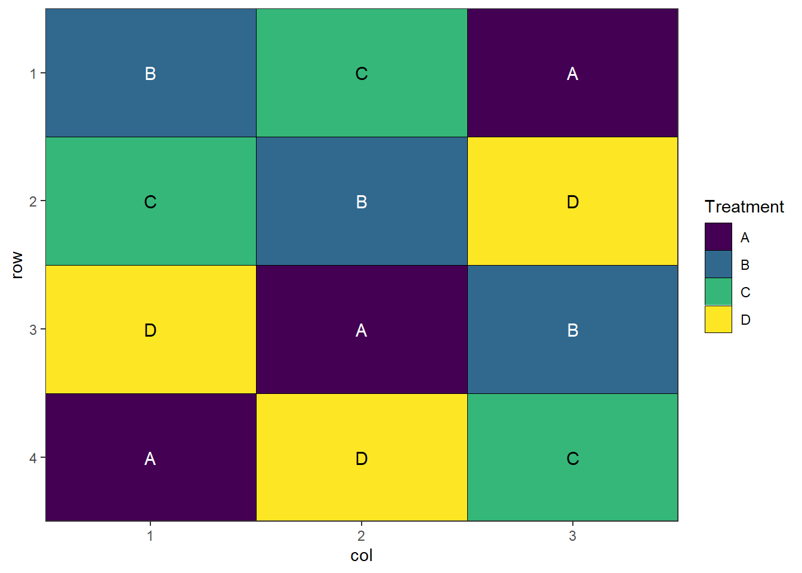
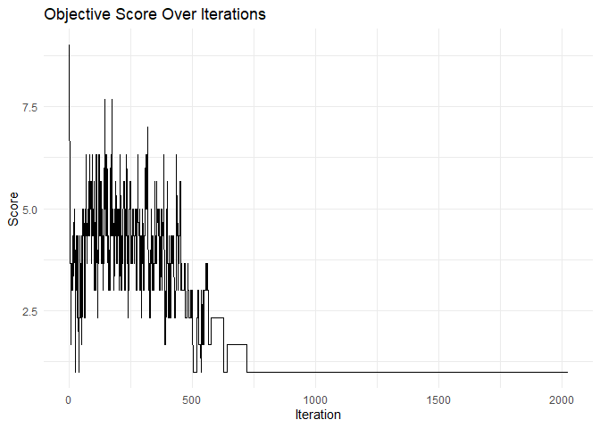
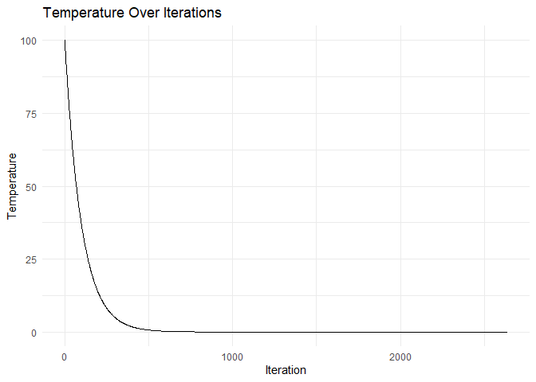
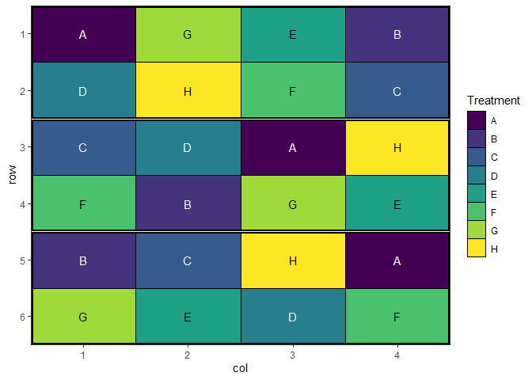

# speed - Spatially Efficient Experimental Designs

## Table of Contents

- [Overview](#overview)
- [Installation](#installation)
- [Features](#features)
- [Examples](#examples)
  - [Basic](#basic)
  - [Blocked design](#blocked-design)
  - [Split-plot
    design](https://biometryhub.github.io/speed/articles/speed.html#split-plot-design)
  - [Strip-plot
    design](https://biometryhub.github.io/speed/articles/complex_designs.html#strip-plot-designs)
  - [P-rep
    design](https://biometryhub.github.io/speed/articles/complex_designs.html#p-rep-partially-replicated-designs)
  - [BIBD](https://biometryhub.github.io/speed/articles/complex_designs.html#balanced-incomplete-block-design-bibd)
  - [More Examples](#more-examples)
- [How It Works](#how-it-works)
- [Citation](#citation)
- [License](#license)

## Overview

The `speed` package optimises spatial experimental designs by
rearranging treatments to improve statistical efficiency while
maintaining statistical validity. It uses simulated annealing to:

- Minimise treatment adjacency (reducing neighbour effects)
- Maintain spatial balance across rows and columns
- Respect blocking constraints if specified
- Provide visualisation tools for design evaluation

## Installation

You can install the development version of speed from
[GitHub](https://github.com/biometryhub/speed) with:

``` r
# pak
if (!require("pak", quietly = TRUE)) install.packages("pak")
pak::pak("biometryhub/speed")

# devtools
if (!require("devtools", quietly = TRUE)) install.packages("devtools")
devtools::install_github("biometryhub/speed")

# remotes
if (!require("remotes", quietly = TRUE)) install.packages("remotes")
remotes::install_github("biometryhub/speed")
```

## Features

- Flexible optimisation of experimental designs
- Support for blocked designs
- Customisable optimisation parameters
- Built-in visualisation functions
- Progress tracking during optimisation
- Early stopping when convergence is reached

See the package
[documentation](https://biometryhub.github.io/speed/reference/index.html)
for more detailed examples and options.

## Examples

### Basic

A simple example optimising a 4×3 completely randomised design with 4
treatments:

``` r
library(speed)

# Create a simple design with 3 replicates of 4 treatments
df <- data.frame(
  row = rep(1:4, each = 3),
  col = rep(1:3, times = 4),
  treatment = rep(LETTERS[1:4], each = 3)
)

# Optimise the design with seed for reproducibility
result <- speed(df, "treatment", seed = 42)
#> row and col are used as row and column, respectively.
#> Optimising level: single treatment within whole design 
#> Level: single treatment within whole design Iteration: 1000 Score: 1 Best: 1 Since Improvement: 475 
#> Level: single treatment within whole design Iteration: 2000 Score: 1 Best: 1 Since Improvement: 1475 
#> Early stopping at iteration 2525 for level single treatment within whole design

# Plot the optimised design
autoplot(result)
```



``` r

# View optimisation progress
plot_progress(result)
```



### Blocked design

You can also optimise designs within blocks:

``` r
# Create a design with blocks
df <- data.frame(
  row = rep(1:6, each = 4),
  col = rep(1:4, times = 6),
  treatment = rep(LETTERS[1:8], 3),
  block = rep(1:3, each = 8)
)

# Optimise while respecting blocks
result <- speed(df,
  "treatment",
  swap_within = "block",
  iterations = 5000,
  seed = 42
)
#> row and col are used as row and column, respectively.
#> Optimising level: single treatment within block 
#> Level: single treatment within block Iteration: 1000 Score: 2.571429 Best: 2.571429 Since Improvement: 543 
#> Level: single treatment within block Iteration: 2000 Score: 2.571429 Best: 2.571429 Since Improvement: 1543 
#> Early stopping at iteration 2457 for level single treatment within block

# Plot the design with block boundaries
autoplot(result)
```



### More Examples

For more detailed examples, see the [getting started
vignette](https://biometryhub.github.io/speed/articles/speed.html) or
the vignette about [more complex
examples](https://biometryhub.github.io/speed/articles/complex_designs.html)
including, but not limited to:

- [Split-plot
  design](https://biometryhub.github.io/speed/articles/speed.html#split-plot-design)
- [Strip-plot
  design](https://biometryhub.github.io/speed/articles/complex_designs.html#strip-plot-designs)
- [P-rep
  design](https://biometryhub.github.io/speed/articles/complex_designs.html#p-rep-partially-replicated-designs)
- [BIBD](https://biometryhub.github.io/speed/articles/complex_designs.html#balanced-incomplete-block-design-bibd)

## How It Works

The `speed` package uses simulated annealing to optimise experimental
designs by evaluating and improving layouts based on an objective
function. By default the optimisation process:

- **Evaluates designs** using a score (lower is better) that combines:
  - **Adjacency score**: Penalises treatments appearing next to each
    other (reduces neighbour effects)
  - **Balance score**: Rewards even distribution of treatments across
    spatial factors (rows, columns, blocks)
- **Proposes changes** by swapping treatments between plots
- **Accepts improvements** and occasionally accepts worse solutions to
  avoid local optima
- **Converges** to an optimised layout through gradual “cooling” of the
  acceptance threshold

You can customise the objective function and optimisation parameters to
suit specific experimental needs (see
[vignettes](https://biometryhub.github.io/speed/articles/custom_objective_functions.html)
for details).

## Citation

If you use `speed` in your research, please cite:

``` R
Warning in citation("speed"): could not determine year for 'speed' from package
DESCRIPTION file
To cite package 'speed' in publications use:

  Rogers S, Taylor J, Edson R, Pipattungsakul W (????). _speed:
  Generate Spatially Efficient Experimental Designs_. R package version
  0.0.3, <https://biometryhub.github.io/speed/>.

A BibTeX entry for LaTeX users is

  @Manual{,
    title = {speed: Generate Spatially Efficient Experimental Designs},
    author = {Sam Rogers and Julian Taylor and Russell Edson and Wasin Pipattungsakul},
    note = {R package version 0.0.3},
    url = {https://biometryhub.github.io/speed/},
  }
```

## License

This project is licensed under the MIT License - see the
[LICENSE](https://biometryhub.github.io/speed/LICENSE.md) file for
details.

## Code of Conduct

Please note that the speed project is released with a [Contributor Code
of Conduct](https://biometryhub.github.io/speed/CODE_OF_CONDUCT.html).
By contributing to this project, you agree to abide by its terms.
