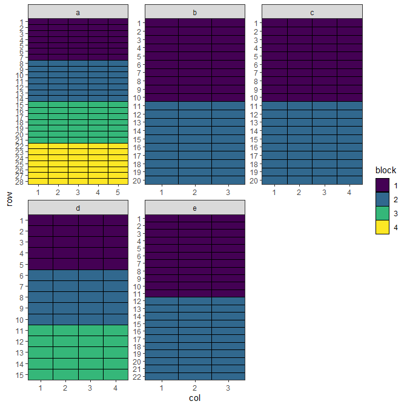
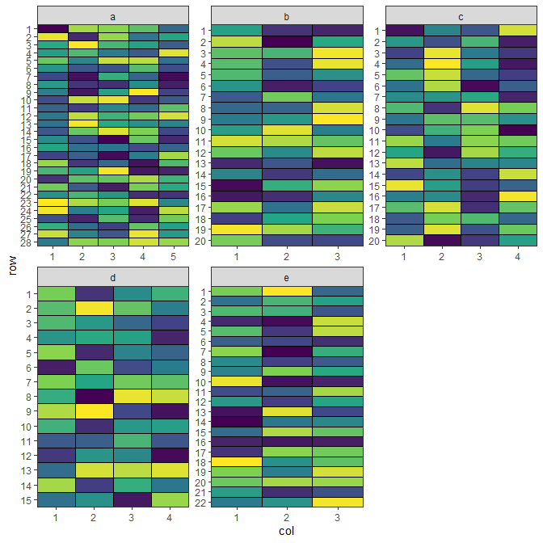
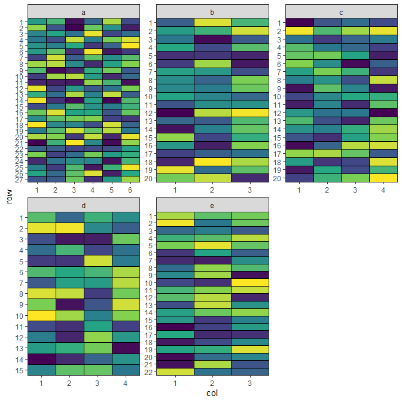
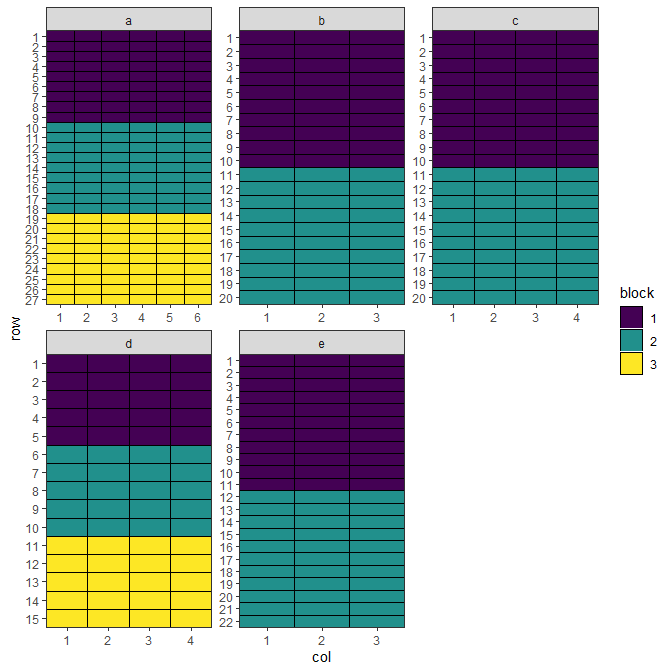
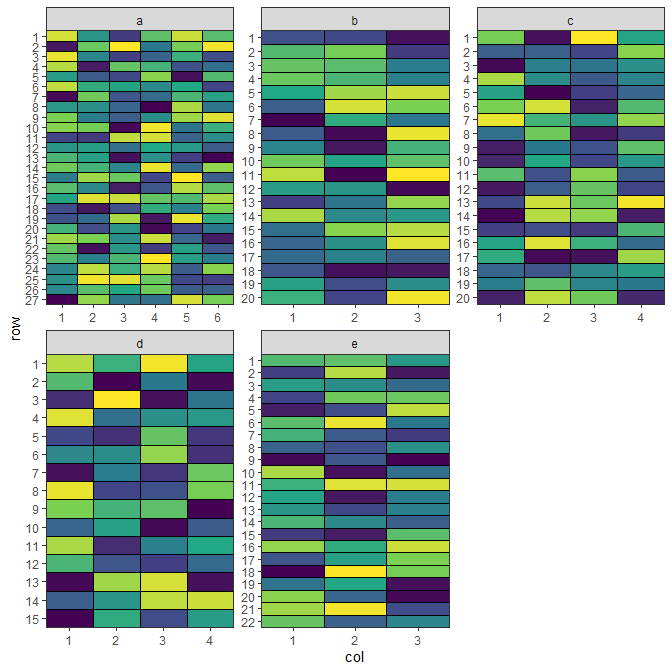
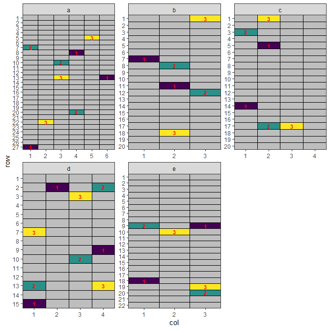

# MET Design

## Overview

Multi-environment trials (MET) are experimental designs used to evaluate the performance of treatments across
different environments. An environment typically represents a unique combination of location, year, season, or
management practice. MET designs are essential for understanding genotype × environment (G×E) interactions,
stability, and adaptability of treatments under different conditions.


``` r
library(speed)
```

## When to Use

- Treatment evaluation across multiple locations and/or years
- Crop breeding and regional recommendation trials
- Testing stability and adaptability
- When results are intended for large geographic areas

## Structure

- **Sites**: Different locations of the trial
- **Site-blocks**: Blocks within sites

# Optimising Allocation across All Sites

## Setting Up MET Design with speed

Now we can create a data frame representing a MET design. Note that we can specify different dimensions for each
site in the `designs` argument.


``` r
all_treatments <- c(rep(1:50, 7), rep(51:57, 8))
met_design <- initialise_design_df(
  items = all_treatments,
  designs = list(
    a = list(nrows = 28, ncols = 5, block_nrows = 7, block_ncols = 5),
    b = list(nrows = 20, ncols = 3, block_nrows = 10, block_ncols = 3),
    c = list(nrows = 20, ncols = 4, block_nrows = 10, block_ncols = 4),
    d = list(nrows = 15, ncols = 4, block_nrows = 5, block_ncols = 4),
    e = list(nrows = 22, ncols = 3, block_nrows = 11, block_ncols = 3)
  )
)

met_design$site_col <- paste(met_design$site, met_design$col, sep = "_")
met_design$site_block <- paste(met_design$site, met_design$block, sep = "_")

head(met_design)
```

```
##   row col treatment row_block col_block block site site_col site_block
## 1   1   1         1         1         1     1    a      a_1        a_1
## 2   2   1         2         1         1     1    a      a_1        a_1
## 3   3   1         3         1         1     1    a      a_1        a_1
## 4   4   1         4         1         1     1    a      a_1        a_1
## 5   5   1         5         1         1     1    a      a_1        a_1
## 6   6   1         6         1         1     1    a      a_1        a_1
```


``` r
met_design$block <- factor(met_design$block)

plot_layout <- function(df, fill) {
  scale_fill <- if (is.numeric(df[[fill]])) {
    ggplot2::scale_fill_viridis_c
  } else {
    ggplot2::scale_fill_viridis_d
  }

  return(
    ggplot2::ggplot(df, ggplot2::aes(col, row, fill = get(fill))) +
      ggplot2::geom_tile(color = "black") +
      scale_fill(na.value = "grey") +
      ggplot2::facet_wrap(~site, scales = "free") +
      ggplot2::scale_x_continuous(expand = c(0, 0), breaks = 1:max(df$col)) +
      ggplot2::scale_y_continuous(expand = c(0, 0), breaks = 1:max(df$row), trans = scales::reverse_trans()) +
      ggplot2::theme_bw() +
      ggplot2::labs(fill = fill) +
      ggplot2::theme(panel.grid.major = ggplot2::element_blank(), panel.grid.minor = ggplot2::element_blank())
  )
}

plot_layout(met_design, "block")
```


{fig-align="default"}

## Performing the Optimisation

For MET designs, we use lists of named arguments to specify the hierarchical structure. The `optimise` parameter
defines what to optimise and constraints at each level.

Each site numbers its rows and columns from 1, so several plots share the same `row`/`col` pair. A MET is not
one grid but several, which share a treatment set and never share an edge. Tell `speed()` which column
separates them with the `by` element of `grid_factors`:


``` r
optimise <- list(
  connectivity = list(spatial_factors = ~site),
  balance = list(swap_within = "site", spatial_factors = ~ site_col + site_block)
)

met_result <- speed(
  data = met_design,
  swap = "treatment",
  early_stop_iterations = 5000,
  optimise = optimise,
  grid_factors = list(dim1 = "row", dim2 = "col", by = "site"),
  optimise_params = optim_params(random_initialisation = TRUE, adj_weight = 0),
  seed = 112
)
```

```
## row and col are used as row and column, respectively.
```

```
## Optimising level: connectivity 
## Level: connectivity Iteration: 1000 Score: 2.341479 Best: 2.341479 Since Improvement: 26 
## Level: connectivity Iteration: 2000 Score: 1.091479 Best: 1.091479 Since Improvement: 38 
## Level: connectivity Iteration: 3000 Score: 0.877193 Best: 0.877193 Since Improvement: 602 
## Level: connectivity Iteration: 4000 Score: 0.8057644 Best: 0.8057644 Since Improvement: 211 
## Level: connectivity Iteration: 5000 Score: 0.7700501 Best: 0.7700501 Since Improvement: 169 
## Level: connectivity Iteration: 6000 Score: 0.7700501 Best: 0.7700501 Since Improvement: 1169 
## Level: connectivity Iteration: 7000 Score: 0.7700501 Best: 0.7700501 Since Improvement: 2169 
## Level: connectivity Iteration: 8000 Score: 0.7700501 Best: 0.7700501 Since Improvement: 3169 
## Level: connectivity Iteration: 9000 Score: 0.7700501 Best: 0.7700501 Since Improvement: 4169 
## Early stopping at iteration 9831 for level connectivity 
## Optimising level: balance 
## Level: balance Iteration: 1000 Score: 8.926692 Best: 8.926692 Since Improvement: 23 
## Level: balance Iteration: 2000 Score: 7.74812 Best: 7.74812 Since Improvement: 160 
## Level: balance Iteration: 3000 Score: 7.605263 Best: 7.605263 Since Improvement: 31 
## Level: balance Iteration: 4000 Score: 7.533835 Best: 7.533835 Since Improvement: 420 
## Optimal score reached at iteration 4465 for level balance
```

``` r
met_result
```

```
## Optimised Experimental Design
## ----------------------------
## Score: 8.26817 
## Iterations Run: 14297 
## Stopped Early: TRUE TRUE 
## Treatments:
##   connectivity: 1, 2, 3, 4, 5, 6, 7, 8, 9, 10, 11, 12, 13, 14, 15, 16, 17, 18, 19, 20, 21, 22, 23, 24, 25, 26, 27, 28, 29, 30, 31, 32, 33, 34, 35, 36, 37, 38, 39, 40, 41, 42, 43, 44, 45, 46, 47, 48, 49, 50, 51, 52, 53, 54, 55, 56, 57
##   balance: 1, 2, 3, 4, 5, 6, 7, 8, 9, 10, 11, 12, 13, 14, 15, 16, 17, 18, 19, 20, 21, 22, 23, 24, 25, 26, 27, 28, 29, 30, 31, 32, 33, 34, 35, 36, 37, 38, 39, 40, 41, 42, 43, 44, 45, 46, 47, 48, 49, 50, 51, 52, 53, 54, 55, 56, 57
## Seed: 112
```

Each site is then scored on its own and the results combined, so no two plots at different sites are ever
treated as neighbours. Without `by`, a design whose sites reuse coordinates is refused rather than silently
pooled - the grid-based diagnostics would otherwise describe a layout that does not exist.

## Output of the Optimisation

The output shows optimisation results for the design. The score and iterations are combined for the entire
design, while the treatments, and stopping criteria are reported separately for each level, allowing you to
assess the quality of optimisation at each hierarchy level.


``` r
str(met_result)
```

```
## List of 9
##  $ design_df     :'data.frame':	406 obs. of  9 variables:
##   ..$ row       : int [1:406] 1 1 1 1 1 1 1 1 1 1 ...
##   ..$ col       : int [1:406] 1 1 1 1 1 2 2 2 2 2 ...
##   ..$ treatment : int [1:406] 1 33 3 45 45 49 9 26 9 57 ...
##   ..$ row_block : num [1:406] 1 1 1 1 1 1 1 1 1 1 ...
##   ..$ col_block : num [1:406] 1 1 1 1 1 1 1 1 1 1 ...
##   ..$ block     : Factor w/ 4 levels "1","2","3","4": 1 1 1 1 1 1 1 1 1 1 ...
##   ..$ site      : chr [1:406] "a" "b" "c" "d" ...
##   ..$ site_col  : chr [1:406] "a_1" "b_1" "c_1" "d_1" ...
##   ..$ site_block: chr [1:406] "a_1" "b_1" "c_1" "d_1" ...
##  $ score         : num 8.27
##  $ scores        :List of 2
##   ..$ connectivity: num [1:9832] 5.13 5.2 5.2 5.2 5.2 ...
##   ..$ balance     : num [1:4465] 10.3 10.2 10.2 10.3 10.3 ...
##  $ temperatures  :List of 2
##   ..$ connectivity: num [1:9832] 100 99 98 97 96.1 ...
##   ..$ balance     : num [1:4465] 100 99 98 97 96.1 ...
##  $ iterations_run: num 14297
##  $ stopped_early : Named logi [1:2] TRUE TRUE
##   ..- attr(*, "names")= chr [1:2] "connectivity" "balance"
##  $ treatments    :List of 2
##   ..$ connectivity: chr [1:57] "1" "2" "3" "4" ...
##   ..$ balance     : chr [1:57] "1" "2" "3" "4" ...
##  $ seed          : num 112
##  $ metadata      :List of 6
##   ..$ levels    : chr [1:2] "connectivity" "balance"
##   ..$ row_column: chr "row"
##   ..$ col_column: chr "col"
##   ..$ grid_by   : chr "site"
##   ..$ per_level :List of 2
##   .. ..$ connectivity:List of 12
##   .. .. ..$ swap            : chr "treatment"
##   .. .. ..$ spatial_factors :Class 'formula'  language ~site
##   .. .. .. .. ..- attr(*, ".Environment")=<environment: R_GlobalEnv> 
##   .. .. ..$ spatial_cols    : chr "site"
##   .. .. ..$ adj_weight      : num 0
##   .. .. ..$ bal_weight      : num 1
##   .. .. ..$ iterations      : num 10000
##   .. .. ..$ start_temp      : num 100
##   .. .. ..$ cooling_rate    : num 0.99
##   .. .. ..$ obj_function    :function (layout_df, swap, spatial_cols, adj_weight = 1, bal_weight = 1, 
##     row_column = "row", col_column = "col", ...)  
##   .. .. .. ..- attr(*, "srcref")= 'srcref' int [1:8] 41 23 90 1 23 1 41 90
##   .. .. .. .. ..- attr(*, "srcfile")=Classes 'srcfilecopy', 'srcfile' <environment: 0x000002250edb7a10> 
##   .. .. ..$ final_score     : num 0.77
##   .. .. ..$ final_components: Named num [1:2] 0 0.77
##   .. .. .. ..- attr(*, "names")= chr [1:2] "adjacency" "balance"
##   .. .. ..$ optimal_score   : num 0.734
##   .. ..$ balance     :List of 12
##   .. .. ..$ swap            : chr "treatment"
##   .. .. ..$ spatial_factors :Class 'formula'  language ~site_col + site_block
##   .. .. .. .. ..- attr(*, ".Environment")=<environment: R_GlobalEnv> 
##   .. .. ..$ spatial_cols    : chr [1:2] "site_col" "site_block"
##   .. .. ..$ adj_weight      : num 0
##   .. .. ..$ bal_weight      : num 1
##   .. .. ..$ iterations      : num 10000
##   .. .. ..$ start_temp      : num 100
##   .. .. ..$ cooling_rate    : num 0.99
##   .. .. ..$ obj_function    :function (layout_df, swap, spatial_cols, adj_weight = 1, bal_weight = 1, 
##     row_column = "row", col_column = "col", ...)  
##   .. .. .. ..- attr(*, "srcref")= 'srcref' int [1:8] 41 23 90 1 23 1 41 90
##   .. .. .. .. ..- attr(*, "srcfile")=Classes 'srcfilecopy', 'srcfile' <environment: 0x000002250edb7a10> 
##   .. .. ..$ final_score     : num 7.5
##   .. .. ..$ final_components: Named num [1:2] 0 7.5
##   .. .. .. ..- attr(*, "names")= chr [1:2] "adjacency" "balance"
##   .. .. ..$ optimal_score   : num 7.5
##   ..$ call      : language speed(data = met_design, swap = "treatment", grid_factors = list(dim1 = "row",      dim2 = "col", by = "site"), e| __truncated__ ...
##  - attr(*, "class")= chr [1:2] "design" "list"
```

No duplicated treatments along any row, column, or block.


``` r
check_no_dupes <- function(df) {
  cat(max(table(df$treatment, df$site_col)), sep = "", ", ")
  cat(max(table(df$treatment, paste0(df$site, df$row))), sep = "", ", ")
  cat(max(table(df$treatment, df$site_block)))
}

df <- met_result$design_df
check_no_dupes(df)
```

```
## 1, 1, 1
```

## Visualise the Output


``` r
plot_layout(met_result$design_df, "treatment") + 
  ggplot2::theme(legend.position = "none")
```


{fig-align="default"}

This design has now been optimised at both the connectivity between sites and the balance within each site.

# Optimising Allocation across Some Sites

## Setting Up MET Design with speed

Now we can create a data frame representing a MET design. Note that we can specify different dimensions for each
site in the `designs` argument.


``` r
fixed_treatments <- rep(1:54, 3)
non_fixed_treatments <- c(rep(1:50, 5), rep(51:54, 4))
met_design <- initialise_design_df(
  designs = list(
    a = list(items = fixed_treatments, nrows = 27, ncols = 6, block_nrows = 9, block_ncols = 6),
    b = list(items = non_fixed_treatments[1:60], nrows = 20, ncols = 3, block_nrows = 10, block_ncols = 3),
    c = list(items = non_fixed_treatments[1:80 + 60], nrows = 20, ncols = 4, block_nrows = 10, block_ncols = 4),
    d = list(items = non_fixed_treatments[1:60 + 140], nrows = 15, ncols = 4, block_nrows = 5, block_ncols = 4),
    e = list(items = non_fixed_treatments[1:66 + 200], nrows = 22, ncols = 3, block_nrows = 11, block_ncols = 3)
  )
)

met_design$site_col <- paste(met_design$site, met_design$col, sep = "_")
met_design$site_block <- paste(met_design$site, met_design$block, sep = "_")
met_design$allocation <- "free"
met_design$allocation[met_design$site == "a"] <- NA

head(met_design)
```

```
##   row col treatment row_block col_block block site site_col site_block
## 1   1   1         1         1         1     1    a      a_1        a_1
## 2   2   1         2         1         1     1    a      a_1        a_1
## 3   3   1         3         1         1     1    a      a_1        a_1
## 4   4   1         4         1         1     1    a      a_1        a_1
## 5   5   1         5         1         1     1    a      a_1        a_1
## 6   6   1         6         1         1     1    a      a_1        a_1
##   allocation
## 1       <NA>
## 2       <NA>
## 3       <NA>
## 4       <NA>
## 5       <NA>
## 6       <NA>
```


``` r
met_design$block <- factor(met_design$block)
plot_layout(met_design, "block")
```


{fig-align="default"}

## Performing the Optimisation

For MET designs, we use lists of named arguments to specify the hierarchical structure. The `optimise` parameter
defines what to optimise and constraints at each level.


``` r
optimise <- list(
  connectivity = list(swap_within = "allocation", spatial_factors = ~site),
  balance = list(swap_within = "site", spatial_factors = ~ site_col + site_block)
)

met_result <- speed(
  data = met_design,
  swap = "treatment",
  early_stop_iterations = 10000,
  iterations = 50000,
  optimise = optimise,
  grid_factors = list(dim1 = "row", dim2 = "col", by = "site"),
  optimise_params = optim_params(random_initialisation = 10, adj_weight = 0),
  seed = 112
)
```

```
## row and col are used as row and column, respectively.
```

```
## Optimising level: connectivity 
## Level: connectivity Iteration: 1000 Score: 1.2355 Best: 1.2355 Since Improvement: 7 
## Level: connectivity Iteration: 2000 Score: 0.7449336 Best: 0.7449336 Since Improvement: 222 
## Optimal score reached at iteration 2803 for level connectivity 
## Optimising level: balance 
## Level: balance Iteration: 1000 Score: 8.951782 Best: 8.951782 Since Improvement: 8 
## Level: balance Iteration: 2000 Score: 7.744235 Best: 7.744235 Since Improvement: 48 
## Level: balance Iteration: 3000 Score: 7.51782 Best: 7.51782 Since Improvement: 689 
## Level: balance Iteration: 4000 Score: 7.253669 Best: 7.253669 Since Improvement: 293 
## Level: balance Iteration: 5000 Score: 7.215933 Best: 7.215933 Since Improvement: 630 
## Level: balance Iteration: 6000 Score: 7.102725 Best: 7.102725 Since Improvement: 121 
## Level: balance Iteration: 7000 Score: 7.102725 Best: 7.102725 Since Improvement: 1121 
## Level: balance Iteration: 8000 Score: 7.102725 Best: 7.102725 Since Improvement: 2121 
## Level: balance Iteration: 9000 Score: 7.027254 Best: 7.027254 Since Improvement: 13 
## Level: balance Iteration: 10000 Score: 6.989518 Best: 6.989518 Since Improvement: 679 
## Level: balance Iteration: 11000 Score: 6.989518 Best: 6.989518 Since Improvement: 1679 
## Level: balance Iteration: 12000 Score: 6.951782 Best: 6.951782 Since Improvement: 464 
## Level: balance Iteration: 13000 Score: 6.951782 Best: 6.951782 Since Improvement: 1464 
## Level: balance Iteration: 14000 Score: 6.951782 Best: 6.951782 Since Improvement: 2464 
## Level: balance Iteration: 15000 Score: 6.951782 Best: 6.951782 Since Improvement: 3464 
## Level: balance Iteration: 16000 Score: 6.951782 Best: 6.951782 Since Improvement: 4464 
## Level: balance Iteration: 17000 Score: 6.951782 Best: 6.951782 Since Improvement: 5464 
## Level: balance Iteration: 18000 Score: 6.951782 Best: 6.951782 Since Improvement: 6464 
## Level: balance Iteration: 19000 Score: 6.951782 Best: 6.951782 Since Improvement: 7464 
## Level: balance Iteration: 20000 Score: 6.914046 Best: 6.914046 Since Improvement: 420 
## Level: balance Iteration: 21000 Score: 6.914046 Best: 6.914046 Since Improvement: 1420 
## Level: balance Iteration: 22000 Score: 6.914046 Best: 6.914046 Since Improvement: 2420 
## Level: balance Iteration: 23000 Score: 6.914046 Best: 6.914046 Since Improvement: 3420 
## Level: balance Iteration: 24000 Score: 6.914046 Best: 6.914046 Since Improvement: 4420 
## Level: balance Iteration: 25000 Score: 6.914046 Best: 6.914046 Since Improvement: 5420 
## Level: balance Iteration: 26000 Score: 6.914046 Best: 6.914046 Since Improvement: 6420 
## Level: balance Iteration: 27000 Score: 6.914046 Best: 6.914046 Since Improvement: 7420 
## Level: balance Iteration: 28000 Score: 6.914046 Best: 6.914046 Since Improvement: 8420 
## Level: balance Iteration: 29000 Score: 6.914046 Best: 6.914046 Since Improvement: 9420 
## Early stopping at iteration 29580 for level balance
```

``` r
met_result
```

```
## Optimised Experimental Design
## ----------------------------
## Score: 7.545772 
## Iterations Run: 32384 
## Stopped Early: TRUE TRUE 
## Treatments:
##   connectivity: 1, 2, 3, 4, 5, 6, 7, 8, 9, 10, 11, 12, 13, 14, 15, 16, 17, 18, 19, 20, 21, 22, 23, 24, 25, 26, 27, 28, 29, 30, 31, 32, 33, 34, 35, 36, 37, 38, 39, 40, 41, 42, 43, 44, 45, 46, 47, 48, 49, 50, 51, 52, 53, 54
##   balance: 1, 2, 3, 4, 5, 6, 7, 8, 9, 10, 11, 12, 13, 14, 15, 16, 17, 18, 19, 20, 21, 22, 23, 24, 25, 26, 27, 28, 29, 30, 31, 32, 33, 34, 35, 36, 37, 38, 39, 40, 41, 42, 43, 44, 45, 46, 47, 48, 49, 50, 51, 52, 53, 54
## Seed: 112
```

## Output of the Optimisation

The output shows optimisation results for the design. The score and iterations are combined for the entire
design, while the treatments, and stopping criteria are reported separately for each level, allowing you to
assess the quality of optimisation at each hierarchy level.


``` r
str(met_result)
```

```
## List of 9
##  $ design_df     :'data.frame':	428 obs. of  10 variables:
##   ..$ row       : int [1:428] 1 1 1 1 1 1 1 1 1 1 ...
##   ..$ col       : int [1:428] 1 1 1 1 1 2 2 2 2 2 ...
##   ..$ treatment : int [1:428] 30 17 1 38 47 36 51 15 19 39 ...
##   ..$ row_block : num [1:428] 1 1 1 1 1 1 1 1 1 1 ...
##   ..$ col_block : num [1:428] 1 1 1 1 1 1 1 1 1 1 ...
##   ..$ block     : Factor w/ 3 levels "1","2","3": 1 1 1 1 1 1 1 1 1 1 ...
##   ..$ site      : chr [1:428] "a" "b" "c" "d" ...
##   ..$ site_col  : chr [1:428] "a_1" "b_1" "c_1" "d_1" ...
##   ..$ site_block: chr [1:428] "a_1" "b_1" "c_1" "d_1" ...
##   ..$ allocation: chr [1:428] NA "free" "free" "free" ...
##  $ score         : num 7.55
##  $ scores        :List of 2
##   ..$ connectivity: num [1:2803] 2.97 3.05 3.05 3.08 3.12 ...
##   ..$ balance     : num [1:29581] 11.2 11.2 11.2 11.2 11.2 ...
##  $ temperatures  :List of 2
##   ..$ connectivity: num [1:2803] 100 99 98 97 96.1 ...
##   ..$ balance     : num [1:29581] 100 99 98 97 96.1 ...
##  $ iterations_run: num 32384
##  $ stopped_early : Named logi [1:2] TRUE TRUE
##   ..- attr(*, "names")= chr [1:2] "connectivity" "balance"
##  $ treatments    :List of 2
##   ..$ connectivity: chr [1:54] "1" "2" "3" "4" ...
##   ..$ balance     : chr [1:54] "1" "2" "3" "4" ...
##  $ seed          : num 112
##  $ metadata      :List of 6
##   ..$ levels    : chr [1:2] "connectivity" "balance"
##   ..$ row_column: chr "row"
##   ..$ col_column: chr "col"
##   ..$ grid_by   : chr "site"
##   ..$ per_level :List of 2
##   .. ..$ connectivity:List of 12
##   .. .. ..$ swap            : chr "treatment"
##   .. .. ..$ spatial_factors :Class 'formula'  language ~site
##   .. .. .. .. ..- attr(*, ".Environment")=<environment: R_GlobalEnv> 
##   .. .. ..$ spatial_cols    : chr "site"
##   .. .. ..$ adj_weight      : num 0
##   .. .. ..$ bal_weight      : num 1
##   .. .. ..$ iterations      : num 50000
##   .. .. ..$ start_temp      : num 100
##   .. .. ..$ cooling_rate    : num 0.99
##   .. .. ..$ obj_function    :function (layout_df, swap, spatial_cols, adj_weight = 1, bal_weight = 1, 
##     row_column = "row", col_column = "col", ...)  
##   .. .. .. ..- attr(*, "srcref")= 'srcref' int [1:8] 41 23 90 1 23 1 41 90
##   .. .. .. .. ..- attr(*, "srcfile")=Classes 'srcfilecopy', 'srcfile' <environment: 0x000002250edb7a10> 
##   .. .. ..$ final_score     : num 0.632
##   .. .. ..$ final_components: Named num [1:2] 0 0.632
##   .. .. .. ..- attr(*, "names")= chr [1:2] "adjacency" "balance"
##   .. .. ..$ optimal_score   : num 0.632
##   .. ..$ balance     :List of 12
##   .. .. ..$ swap            : chr "treatment"
##   .. .. ..$ spatial_factors :Class 'formula'  language ~site_col + site_block
##   .. .. .. .. ..- attr(*, ".Environment")=<environment: R_GlobalEnv> 
##   .. .. ..$ spatial_cols    : chr [1:2] "site_col" "site_block"
##   .. .. ..$ adj_weight      : num 0
##   .. .. ..$ bal_weight      : num 1
##   .. .. ..$ iterations      : num 50000
##   .. .. ..$ start_temp      : num 100
##   .. .. ..$ cooling_rate    : num 0.99
##   .. .. ..$ obj_function    :function (layout_df, swap, spatial_cols, adj_weight = 1, bal_weight = 1, 
##     row_column = "row", col_column = "col", ...)  
##   .. .. .. ..- attr(*, "srcref")= 'srcref' int [1:8] 41 23 90 1 23 1 41 90
##   .. .. .. .. ..- attr(*, "srcfile")=Classes 'srcfilecopy', 'srcfile' <environment: 0x000002250edb7a10> 
##   .. .. ..$ final_score     : num 6.91
##   .. .. ..$ final_components: Named num [1:2] 0 6.91
##   .. .. .. ..- attr(*, "names")= chr [1:2] "adjacency" "balance"
##   .. .. ..$ optimal_score   : num 6.84
##   ..$ call      : language speed(data = met_design, swap = "treatment", grid_factors = list(dim1 = "row",      dim2 = "col", by = "site"), i| __truncated__ ...
##  - attr(*, "class")= chr [1:2] "design" "list"
```

No duplicated treatments along any row, column, or block.


``` r
df <- met_result$design_df
check_no_dupes(df)
```

```
## 1, 1, 2
```

Site "a" maintains 3 replicates and no missing treatments in any other sites.


``` r
treatment_count <- table(df$treatment, df$site)
c(min(treatment_count[, "a"]), max(treatment_count[, "a"]))
```

```
## [1] 3 3
```

``` r
c(min(treatment_count[, -1]), max(treatment_count[, -1]))
```

```
## [1] 1 2
```

## Visualise the Output


``` r
plot_layout(met_result$design_df, "treatment") + 
  ggplot2::theme(legend.position = "none")
```


{fig-align="default"}

This design has now been optimised at both the connectivity between sites and the balance within each site.

# Optimising Partial Allocation across Sites

## Setting Up MET Design with speed

Now we can create a data frame representing a MET design. Note that we can specify different dimensions for each
site in the `designs` argument. Also, some treatments are pre-allocated to each site:

- Site 'a': Treatments 1-5
- Site 'b': Treatments 1-4
- Site 'c': Treatments 1-7
- Site 'd': Treatments 1-3, 8-9
- Site 'e': Treatments 1-5

::: {.callout-note}
Note that `speed >= 0.0.5` is required. Otherwise, there would be a bug caused by random initialisation later
on.
:::


``` r
# prepare treatments
fixed_treatments <- list(
  a = rep(1:5, 3),
  b = rep(1:4, 2),
  c = rep(1:7, 2),
  d = c(rep(1:3, 3), rep(8:10, 2)),
  e = rep(1:5, 2)
)
non_fixed_treatments <- c(rep(11:19, 8), rep(20:61, 7))

met_design <- initialise_design_df(
  items = 1,
  designs = list(
    a = list(nrows = 27, ncols = 6, block_nrows = 9, block_ncols = 6),
    b = list(nrows = 20, ncols = 3, block_nrows = 10, block_ncols = 3),
    c = list(nrows = 20, ncols = 4, block_nrows = 10, block_ncols = 4),
    d = list(nrows = 15, ncols = 4, block_nrows = 5, block_ncols = 4),
    e = list(nrows = 22, ncols = 3, block_nrows = 11, block_ncols = 3)
  )
)
met_design$allocation <- "free"

# add treatments to design
for (site in unique(met_design$site)) {
  n_plots_site <- nrow(met_design[met_design$site == site, ])
  n_fixed <- length(fixed_treatments[[site]])
  non_fixed_indices <- 1:(n_plots_site - n_fixed)

  treatments <- c(fixed_treatments[[site]], non_fixed_treatments[non_fixed_indices])
  met_design[met_design$site == site, ]$treatment <- treatments
  met_design[met_design$site == site & met_design$treatment %in% fixed_treatments[[site]], ]$allocation <- NA

  non_fixed_treatments <- non_fixed_treatments[-non_fixed_indices]
}

met_design$site_col <- paste(met_design$site, met_design$col, sep = "_")
met_design$site_block <- paste(met_design$site, met_design$block, sep = "_")

head(met_design)
```

```
##   row col treatment row_block col_block block site allocation site_col
## 1   1   1         1         1         1     1    a       <NA>      a_1
## 2   2   1         2         1         1     1    a       <NA>      a_1
## 3   3   1         3         1         1     1    a       <NA>      a_1
## 4   4   1         4         1         1     1    a       <NA>      a_1
## 5   5   1         5         1         1     1    a       <NA>      a_1
## 6   6   1         1         1         1     1    a       <NA>      a_1
##   site_block
## 1        a_1
## 2        a_1
## 3        a_1
## 4        a_1
## 5        a_1
## 6        a_1
```


``` r
met_design$block <- factor(met_design$block)
plot_layout(met_design, "block")
```


{fig-align="default"}

## Performing the Optimisation

For MET designs, we use lists of named arguments to specify the hierarchical structure. The `optimise` parameter
defines what to optimise and constraints at each level.


``` r
optimise <- list(
  connectivity = list(swap_within = "allocation", spatial_factors = ~site),
  balance = list(swap_within = "site", spatial_factors = ~ site_col + site_block)
)

met_result <- speed(
  data = met_design,
  swap = "treatment",
  early_stop_iterations = 8000,
  iterations = 50000,
  optimise = optimise,
  grid_factors = list(dim1 = "row", dim2 = "col", by = "site"),
  optimise_params = optim_params(random_initialisation = 30, adj_weight = 0),
  seed = 112
)
```

```
## row and col are used as row and column, respectively.
```

```
## Optimising level: connectivity 
## Level: connectivity Iteration: 1000 Score: 3.290164 Best: 3.290164 Since Improvement: 19 
## Level: connectivity Iteration: 2000 Score: 2.290164 Best: 2.290164 Since Improvement: 249 
## Level: connectivity Iteration: 3000 Score: 2.023497 Best: 2.023497 Since Improvement: 145 
## Level: connectivity Iteration: 4000 Score: 1.956831 Best: 1.956831 Since Improvement: 454 
## Level: connectivity Iteration: 5000 Score: 1.923497 Best: 1.923497 Since Improvement: 141 
## Level: connectivity Iteration: 6000 Score: 1.923497 Best: 1.923497 Since Improvement: 1141 
## Level: connectivity Iteration: 7000 Score: 1.923497 Best: 1.923497 Since Improvement: 2141 
## Level: connectivity Iteration: 8000 Score: 1.923497 Best: 1.923497 Since Improvement: 3141 
## Level: connectivity Iteration: 9000 Score: 1.923497 Best: 1.923497 Since Improvement: 4141 
## Level: connectivity Iteration: 10000 Score: 1.923497 Best: 1.923497 Since Improvement: 5141 
## Level: connectivity Iteration: 11000 Score: 1.923497 Best: 1.923497 Since Improvement: 6141 
## Level: connectivity Iteration: 12000 Score: 1.890164 Best: 1.890164 Since Improvement: 50 
## Level: connectivity Iteration: 13000 Score: 1.890164 Best: 1.890164 Since Improvement: 1050 
## Level: connectivity Iteration: 14000 Score: 1.890164 Best: 1.890164 Since Improvement: 2050 
## Level: connectivity Iteration: 15000 Score: 1.890164 Best: 1.890164 Since Improvement: 3050 
## Level: connectivity Iteration: 16000 Score: 1.890164 Best: 1.890164 Since Improvement: 4050 
## Level: connectivity Iteration: 17000 Score: 1.890164 Best: 1.890164 Since Improvement: 5050 
## Level: connectivity Iteration: 18000 Score: 1.890164 Best: 1.890164 Since Improvement: 6050 
## Level: connectivity Iteration: 19000 Score: 1.890164 Best: 1.890164 Since Improvement: 7050 
## Early stopping at iteration 19950 for level connectivity 
## Optimising level: balance 
## Level: balance Iteration: 1000 Score: 9.451366 Best: 9.451366 Since Improvement: 5 
## Level: balance Iteration: 2000 Score: 7.784699 Best: 7.784699 Since Improvement: 1 
## Level: balance Iteration: 3000 Score: 7.584699 Best: 7.584699 Since Improvement: 84 
## Level: balance Iteration: 4000 Score: 7.318033 Best: 7.318033 Since Improvement: 13 
## Level: balance Iteration: 5000 Score: 7.151366 Best: 7.151366 Since Improvement: 410 
## Level: balance Iteration: 6000 Score: 7.151366 Best: 7.151366 Since Improvement: 1410 
## Level: balance Iteration: 7000 Score: 7.151366 Best: 7.151366 Since Improvement: 2410 
## Level: balance Iteration: 8000 Score: 7.151366 Best: 7.151366 Since Improvement: 3410 
## Level: balance Iteration: 9000 Score: 7.151366 Best: 7.151366 Since Improvement: 4410 
## Level: balance Iteration: 10000 Score: 7.151366 Best: 7.151366 Since Improvement: 5410 
## Level: balance Iteration: 11000 Score: 7.084699 Best: 7.084699 Since Improvement: 130 
## Level: balance Iteration: 12000 Score: 7.084699 Best: 7.084699 Since Improvement: 1130 
## Level: balance Iteration: 13000 Score: 7.084699 Best: 7.084699 Since Improvement: 2130 
## Level: balance Iteration: 14000 Score: 7.051366 Best: 7.051366 Since Improvement: 775 
## Level: balance Iteration: 15000 Score: 7.051366 Best: 7.051366 Since Improvement: 1775 
## Level: balance Iteration: 16000 Score: 7.051366 Best: 7.051366 Since Improvement: 2775 
## Level: balance Iteration: 17000 Score: 7.051366 Best: 7.051366 Since Improvement: 3775 
## Level: balance Iteration: 18000 Score: 7.018033 Best: 7.018033 Since Improvement: 110 
## Level: balance Iteration: 19000 Score: 7.018033 Best: 7.018033 Since Improvement: 1110 
## Level: balance Iteration: 20000 Score: 7.018033 Best: 7.018033 Since Improvement: 2110 
## Level: balance Iteration: 21000 Score: 7.018033 Best: 7.018033 Since Improvement: 3110 
## Level: balance Iteration: 22000 Score: 7.018033 Best: 7.018033 Since Improvement: 4110 
## Level: balance Iteration: 23000 Score: 7.018033 Best: 7.018033 Since Improvement: 5110 
## Level: balance Iteration: 24000 Score: 7.018033 Best: 7.018033 Since Improvement: 6110 
## Level: balance Iteration: 25000 Score: 7.018033 Best: 7.018033 Since Improvement: 7110 
## Optimal score reached at iteration 25638 for level balance
```

``` r
met_result
```

```
## Optimised Experimental Design
## ----------------------------
## Score: 8.874863 
## Iterations Run: 45589 
## Stopped Early: TRUE TRUE 
## Treatments:
##   connectivity: 1, 2, 3, 4, 5, 6, 7, 8, 9, 10, 11, 12, 13, 14, 15, 16, 17, 18, 19, 20, 21, 22, 23, 24, 25, 26, 27, 28, 29, 30, 31, 32, 33, 34, 35, 36, 37, 38, 39, 40, 41, 42, 43, 44, 45, 46, 47, 48, 49, 50, 51, 52, 53, 54, 55, 56, 57, 58, 59, 60, 61
##   balance: 1, 2, 3, 4, 5, 6, 7, 8, 9, 10, 11, 12, 13, 14, 15, 16, 17, 18, 19, 20, 21, 22, 23, 24, 25, 26, 27, 28, 29, 30, 31, 32, 33, 34, 35, 36, 37, 38, 39, 40, 41, 42, 43, 44, 45, 46, 47, 48, 49, 50, 51, 52, 53, 54, 55, 56, 57, 58, 59, 60, 61
## Seed: 112
```

## Output of the Optimisation

The output shows optimisation results for the design. The score and iterations are combined for the entire
design, while the treatments, and stopping criteria are reported separately for each level, allowing you to
assess the quality of optimisation at each hierarchy level.


``` r
str(met_result)
```

```
## List of 9
##  $ design_df     :'data.frame':	428 obs. of  10 variables:
##   ..$ row       : int [1:428] 1 1 1 1 1 1 1 1 1 1 ...
##   ..$ col       : int [1:428] 1 1 1 1 1 2 2 2 2 2 ...
##   ..$ treatment : chr [1:428] "57" "16" "48" "54" ...
##   ..$ row_block : num [1:428] 1 1 1 1 1 1 1 1 1 1 ...
##   ..$ col_block : num [1:428] 1 1 1 1 1 1 1 1 1 1 ...
##   ..$ block     : Factor w/ 3 levels "1","2","3": 1 1 1 1 1 1 1 1 1 1 ...
##   ..$ site      : chr [1:428] "a" "b" "c" "d" ...
##   ..$ allocation: chr [1:428] NA NA NA NA ...
##   ..$ site_col  : chr [1:428] "a_1" "b_1" "c_1" "d_1" ...
##   ..$ site_block: chr [1:428] "a_1" "b_1" "c_1" "d_1" ...
##  $ score         : num 8.87
##  $ scores        :List of 2
##   ..$ connectivity: num [1:19951] 5.16 5.12 5.12 5.12 5.12 ...
##   ..$ balance     : num [1:25638] 12.1 12.1 12.1 12 12 ...
##  $ temperatures  :List of 2
##   ..$ connectivity: num [1:19951] 100 99 98 97 96.1 ...
##   ..$ balance     : num [1:25638] 100 99 98 97 96.1 ...
##  $ iterations_run: num 45589
##  $ stopped_early : Named logi [1:2] TRUE TRUE
##   ..- attr(*, "names")= chr [1:2] "connectivity" "balance"
##  $ treatments    :List of 2
##   ..$ connectivity: chr [1:61] "1" "2" "3" "4" ...
##   ..$ balance     : chr [1:61] "1" "2" "3" "4" ...
##  $ seed          : num 112
##  $ metadata      :List of 6
##   ..$ levels    : chr [1:2] "connectivity" "balance"
##   ..$ row_column: chr "row"
##   ..$ col_column: chr "col"
##   ..$ grid_by   : chr "site"
##   ..$ per_level :List of 2
##   .. ..$ connectivity:List of 12
##   .. .. ..$ swap            : chr "treatment"
##   .. .. ..$ spatial_factors :Class 'formula'  language ~site
##   .. .. .. .. ..- attr(*, ".Environment")=<environment: R_GlobalEnv> 
##   .. .. ..$ spatial_cols    : chr "site"
##   .. .. ..$ adj_weight      : num 0
##   .. .. ..$ bal_weight      : num 1
##   .. .. ..$ iterations      : num 50000
##   .. .. ..$ start_temp      : num 100
##   .. .. ..$ cooling_rate    : num 0.99
##   .. .. ..$ obj_function    :function (layout_df, swap, spatial_cols, adj_weight = 1, bal_weight = 1, 
##     row_column = "row", col_column = "col", ...)  
##   .. .. .. ..- attr(*, "srcref")= 'srcref' int [1:8] 41 23 90 1 23 1 41 90
##   .. .. .. .. ..- attr(*, "srcfile")=Classes 'srcfilecopy', 'srcfile' <environment: 0x000002250edb7a10> 
##   .. .. ..$ final_score     : num 1.89
##   .. .. ..$ final_components: Named num [1:2] 0 1.89
##   .. .. .. ..- attr(*, "names")= chr [1:2] "adjacency" "balance"
##   .. .. ..$ optimal_score   : num 0.557
##   .. ..$ balance     :List of 12
##   .. .. ..$ swap            : chr "treatment"
##   .. .. ..$ spatial_factors :Class 'formula'  language ~site_col + site_block
##   .. .. .. .. ..- attr(*, ".Environment")=<environment: R_GlobalEnv> 
##   .. .. ..$ spatial_cols    : chr [1:2] "site_col" "site_block"
##   .. .. ..$ adj_weight      : num 0
##   .. .. ..$ bal_weight      : num 1
##   .. .. ..$ iterations      : num 50000
##   .. .. ..$ start_temp      : num 100
##   .. .. ..$ cooling_rate    : num 0.99
##   .. .. ..$ obj_function    :function (layout_df, swap, spatial_cols, adj_weight = 1, bal_weight = 1, 
##     row_column = "row", col_column = "col", ...)  
##   .. .. .. ..- attr(*, "srcref")= 'srcref' int [1:8] 41 23 90 1 23 1 41 90
##   .. .. .. .. ..- attr(*, "srcfile")=Classes 'srcfilecopy', 'srcfile' <environment: 0x000002250edb7a10> 
##   .. .. ..$ final_score     : num 6.98
##   .. .. ..$ final_components: Named num [1:2] 0 6.98
##   .. .. .. ..- attr(*, "names")= chr [1:2] "adjacency" "balance"
##   .. .. ..$ optimal_score   : num 6.98
##   ..$ call      : language speed(data = met_design, swap = "treatment", grid_factors = list(dim1 = "row",      dim2 = "col", by = "site"), i| __truncated__ ...
##  - attr(*, "class")= chr [1:2] "design" "list"
```

No duplicated treatments along any row, column, or block.


``` r
df <- met_result$design_df
check_no_dupes(df)
```

```
## 1, 1, 1
```

All sites maintain pre-allocated treatments.


``` r
treatment_count <- table(df$site, df$treatment)
for (site in names(fixed_treatments)) {
  print(treatment_count[site, unique(as.character(fixed_treatments[[site]])), drop = FALSE])
}
```

```
##    
##     1 2 3 4 5
##   a 3 3 3 3 3
##    
##     1 2 3 4
##   b 2 2 2 2
##    
##     1 2 3 4 5 6 7
##   c 2 2 2 2 2 2 2
##    
##     1 2 3 8 9 10
##   d 3 3 3 2 2  2
##    
##     1 2 3 4 5
##   e 2 2 2 2 2
```

## Visualise the Output


``` r
df$treatment <- as.numeric(df$treatment)
plot_layout(df, "treatment") + 
  ggplot2::theme(legend.position = "none")
```


{fig-align="default"}

The placements of common pre-allocated treatments.


``` r
df$treatment <- ifelse(df$treatment < 4, df$treatment, NA)
plot_layout(df, "treatment") +
  ggplot2::geom_text(
    ggplot2::aes(label = treatment),
    size = 3,
    color = "red",
    na.rm = TRUE,
    fontface = "bold"
  ) +
  ggplot2::theme(legend.position = "none")
```


{fig-align="default"}

This design has now been optimised at both the connectivity between sites and the balance within each site.

# Spatial Design Considerations

## Field Shape and Orientation

## Neighbour Effects

# Using `speed` Effectively

1. **Set appropriate parameters**: Balance optimisation time with improvement <!-- Link to vignette on parameters -->
2. **[Visualise designs](autoplot.html)**: Always plot layouts before implementation  <!-- Link to autoplot -->
3. **Compare alternatives**: Test multiple blocking strategies
4. **Validate results**: Check constraint satisfaction and efficiency metrics

# Conclusion

## Further Reading

# Related Vignettes

*This vignette demonstrates the versatility of the `speed` package for agricultural experimental design. For more advanced applications and custom designs, consult the package documentation and additional vignettes.*
